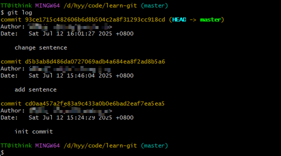
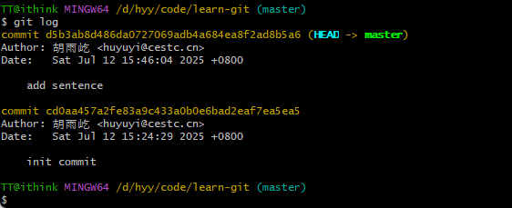

# Git 基础

Git 是目前世界上最先进的**分布式**版本控制系统，版本控制系统的好处在于可以帮我们**自动**管理文件的每次改动

相比于传统**集中式**版本控制系统如 SVN，有如下优势：

- 不需要联网，每个人电脑上都有一个完整的版本库
- 强大的分支管理
- ......


## 安装 Git

linux、macOS 以及 windows 系统都可以使用相应的包管理器进行安装：

```bash
# linux
sudo apt install git

# macOS
brew install git

# windows 这里推荐使用 Scoop 包管理器（需要先安装 Scoop)
scoop install git
```

另外，windows 也可以直接去 [git 官网]([Git - Downloading Package](https://git-scm.com/downloads/win))下载安装程序，安装步骤就是无脑下一步

以 windows 系统为例，安装完成之后右键菜单会出现以下两个选项：


一般只使用 `Open Git Bash here` 在指定目录下去执行 git 指令就可以了


## 创建版本库

版本库又叫仓库（Repository），可以简单的理解为一个目录，里面的所有文件都可以被 Git 管理起来，每个文件的修改、删除，Git 都能跟踪，以便任何时刻都可以进行追踪或回溯

这里使用命令行新建一个目录并切换到该目录下：

```bash
mkdir learn-git
cd learn-git
pwd
/d/hyy/code/learn-git
```

使用 `git init` 把该目录变成 git 可以管理的仓库：


git 仓库嗖的一下就建好了，此时可以看到当前目录下多了一个 `.git` 目录，里面是 git 用来管理版本库的，没事不要乱动，这个目录默认是隐藏的：


也可以使用 `ls -ah` 命令查看隐藏的项目

### 工作区和暂存区

Git 和 SVN 等不同的是有一个暂存区的概念

**工作区（Working Directory）**：

在电脑里能看到的目录

**版本库（Repository）**：

工作区有一个隐藏目录 `.git` ，里面存放的就是 Git 的版本库，里面存了很多东西，其中最重要的就是称为 `stage`（或者叫 `index`）的暂存区，还有 Git 为我们自动创建的第一个分支 `master`，以及指向 master 的一个指针叫 `HEAD`

### 将文件添加到版本库

在创建完仓库后，新建两个文件 `file1.md` 和 `file2.md`，只需要两步就能把他们放到 git 仓库：

- 使用命令 `git add <file>`，可反复多次使用，添加多个文件
- 使用命令 `git commit -m <message>`，其中 message 是必填项表示此次提交的信息

```bash
# 把文件添加到仓库
git add <file>

# 把文件提交到仓库
git commit -m 'commit message'
```


刚刚添加并提交了两个文件，这时候来改一下文件中的内容，然后使用 `git status` 命令**查看当前仓库的状态**：


输出的信息意思是：`file1.md` 文件被修改过了，但是没有被添加到 git 仓库中

> `git add` 实际上是把文件添加到暂存区
>
> `git commit` 实际上是把暂存区的所有内容提交到当前分支

### 查看修改的内容

使用 `git diff` 命令查看具体修改的内容：


可以看到文件第一行添加了一句话，使用的格式是 Unix 通用的 diff 格式

使用 `git add` 命令将 `file1.md` 添加到仓库后，然后再使用 `git status` 命令查看当前状态：


输出的信息意思是：要被提交的修改包括 `file1.md`，下一步就可以放心地提交了

使用 `git commit` 提交后查看当前状态：


输出信息表示当前没有需要提交的修改，工作目录是干净（working tree clean）的

```bash
# 查看具体修改了什么内容，后面可以跟具体的文件，一般在 git add 前查看
git diff
git diff <file>
# 当前版本的指定文件
git diff HEAD -- <file>
```

### 管理修改

git 优秀的地方之一在于它管理的是修改而不是文件

每次修改，如果不用 `git add` 到暂存区，那就不会加入到 `commit` 中


## 版本回退

假设你对文件进行了多次修改，然后不停地提交到 git 仓库中，那怎么知道每次改了什么呢，我不可能记得的呀

这时就可以使用 `git log` 命令查看提交历史，显示从最近到最远的提交日志：



可以看到我提交了三次，还可以使用 `git log --pretty=oneline` 在一行内打印每次提交的信息：


在每行开头的一大坨字符串是 `commit id`（版本号），由 `SHA1` 算法计算出来的十六进制数字

> 为什么 git 不像 svn 那样使用 1，2，3 这种简单的递增数字作为版本号，因为 git 是分布式的，可以多人在同一个版本库里工作，如果使用 1，2，3 这种肯定就冲突了

接下来进入重头戏：时光穿梭！我想把 `file1.md` 文件回退到上一个版本，该怎么做？

在 git 中使用 `HEAD` 表示当前版本，上一个版本是 `HEAD^`，上上一个版本就是 `HEAD^^`，上 100 个版本 `HEAD~100`

使用 `git reset`：

```bash
git reset --hard HEAD^
```

这里可以指定可选参数，一般使用 `--hard` 就行

- `--hard` 会回退到上个版本的已提交状态-
- `--soft` 会回退到上个版本的未提交状态
- `--mixed` 会回退到上个版本已添加但未提交的状态


此时文件被回退到上一个版本，使用 `git log` 查看一下：



天塌了！最新提交的版本不见了！怎么办？

只要命令行还没关，找到之前最新的 `commit id`，我这儿是 `93ce171...` 开头的，就可以指定回到“未来的”那个版本：

```bash
git reset --hard 93ce171
```

> `commit id` 只需要输入前几位就可以了，git 会自动去匹配，当然也不要太短


可以看到回退到了未来的最新版本，我胡汉三又回来了！

>  git 的版本回退速度非常快，因为 git 只是移动内部的 **HEAD 指针**，顺便把工作区的文件更新了，所以 HEAD 指针指向哪里，版本就是哪个

众所周知，人总是喜欢反复无常，比如某一天下班我回退了版本后为了给公司省电把电脑关机了，第二天那个斜眼经理又让我恢复到昨天的版本。。。世上没有后悔药，但 git 有！

使用 `git reflog` 命令查看所有分支和 HEAD 的变动历史（包括提交、重置、合并等操作）：


## 撤销修改

假设你有一次不小心往文件中添加了一串这样的文字：

```plain
My shabby company is still using SVN.
```

还好你及时醒悟，选择删掉这段文字，查看一下当前状态：


可以看到 git 提示你可以使用 `git restore <file>` 命令忽略更改（旧版 git 使用的是 `git checkout -- <file>`)

```bash
# git 旧语法
git checkout -- <file>

# git 新语法
git restore <file>
```

假设你之前糊涂把之前那段话添加到了暂存区（执行了 `git add` 操作），现在想回头怎么办？还是先看一下状态：


git 提示你可以使用 `git restore --staged <file>` 命令把暂存区的修改撤销掉（unstage）：

```bash
# git 旧语法
git reset HEAD <file>

# git 新语法
git restore --staged <file>
```

如果你把那句话提交到了版本库（执行了 `git commit`）命令，可以使用之前版本回退功能，但是你要是推送到了公司的远程仓库，那你今年的年终奖就别想了

总结一下：

撤销修改分为两种情况，一种是没有添加到暂存区，撤销修改就是恢复到和版本库一样的状态：

```bash
git checkout -- <file>
# or
git restore <file>
```

一种是已经添加到了暂存区，把暂存区的修改撤销掉（unstage），重新放回工作区：

```bash
git reset HEAD <file>
# or
git restore --staged <file>
```

> git reset 命令既可以回退版本，也可以把暂存区的修改回退到工作区

## 远程仓库

远程仓库可以理解为一台运行 Git 的服务器，可以自己搭建，不过现在还没有必要，好在有 GitHub 这种提供 Git 仓库托管服务的网站（Gitee、GitLab 等类似）

本地 Git 仓库和 GitHub 仓库之间的传输是通过 SSH 加密的，所以需要配置一些东西

### 配置用户名和邮箱

```bash
# 全局配置
git config --global user.name yourname
git config --global user.email youremail@example.com
```

### 创建 SSH Key

```bash
ssh-keygen -t rsa -C youremail@example.com
```


一直回车就行，完事会生成两个文件，在一个包含 `.ssh` 目录中去找一找,，这里给你看一下我存放的位置：


`id_rsa` 是私钥，不能泄露出去，`id_rsa.pub` 是公钥，需要到 Github 上配置一下：


点击 `New SSH key` ，起一个 Title，把之前生成的 `id_rsa.pub` 文件中的内容拷进来点击添加就可以了：


>  为什么 GitHub 需要 SSH Key 呢？因为 GitHub 需要识别出你推送的提交确实是你推送的

### 添加远程仓库

在 github 上新建一个远程仓库：


创建完成之后可以看到 github 给出的提示：


提示我们在本地新建一个仓库或者将本地已有仓库与之关联，可以看到他这里还多一个 `git branch -M main` 的命令，意思是把默认的 `master` 分支改个名字叫 `main`，至于为什么要这么做，有国外的政治正确在里面，这里就不细嗦了，你可能会长大嘴巴啊：国外不是都很 open 吗，我只能说国外（没错就是 US）的言论自由也不是很 free

言归正传，我们在一个**包含 git 版本库的目录**中（可别整岔了）输入命令添加远程仓库：

```bash
git remote add origin git@github.com:xxx/test.git
```

这里的 `origin` 就是远程仓库的名字，这是 git 默认的叫法，将这个 `git@github.com:xxx/test.git` 改成你自己的，下一步就可以把本地的版本库都提交到上面：

```bash
git push -u origin master
```

> 这里的 `-u` 是 `--set-upstream` 的简写，表示**建立本地分支与远程分支的跟踪关系**（tracking relationship），使得后续的 `git push` 或 `git pull` 操作可以省略远程分支名，直接使用 `git push` 或 `git pull` 即可

如果碰到下面这种情况了，说明你之前**创建 SSH Key** 的工作没有做到位，自己再检查一下吧


### 删除远程仓库

如果一个手抖把远程仓库地址添加错了，可以使用以下命令删除：

```bash
git remote rm origin
```


### 克隆远程仓库

使用 `git clone` 命令将远程仓库克隆到本地：

```
git clone git@github.com:xxx/test.git
```


## 分支管理

```bash
# 查看分支，指定 -a 参数会查看所有分支（包括远程分支）
git branch -a

# 新建分支
git branch <branch_name>

# 切换分支，指定 -b 参数会顺便切换到创建的分支上
git checkout -b <branch_name>
# 切换分支（git 新语法），指定 -c 参数会顺便切换到创建的分支上
git switch -c <branch_name>

# 合并某分支到当前分支
git merge <branch_name>

# 删除分支
git branch -d <branch_name>
```

> 一般 master 分支会作为主分支，作为稳定版本使用
>
> 开发代码会新建一个 dev 分支在上面工作，测试没问题可以发版了就合并到 master 上面去

标准化的分支管理策略：


- master 分支：主分支
- hotfix 分支：用于解决主分支上的 bug（线上问题紧急修复），从主分支上拉取，解决完了合并到主分支
- release 分支：测试新功能的分支，从 dev 分支上拉取，测试完了合并到 dev 分支和 master 分支
- dev 分支：开发分支，多个人情况下一般不直接在 dev 分支上修改代码，而是创建自己的独立分支
- feature 分支：用于开发新功能，从 dev 分支上拉取，开发完了合并到 dev 分支上去

### 多人协作

```bash
# 查看远程库信息
git remote -v

# 在本地创建和远程分支对应的分支，名称最好一样
git checkout -b <branch_name> origin/<branch_name>

# 在推送前最好先拉取一下远程分支试图合并，因为远程分支比你的本地更新
git pull origin <branch_name>

# 如果 pull 失败提示 no tracking information，使用如下命令建立本地分支和远程分支的关联
git branch --set-upstream <branch_name> origin/<branch_name>

# pull 成功后如果有冲突，要先解决冲突，再 push
git push origin <branch_name>
```

建立本地分支和远程分支的关联后，就可以直接使用 `git pull` 和 `git push` 去拉取和提交代码了

> 本地新建的分支如果不推送到远程，对其他人就是不可见的

## 标签管理

发版的时候一般会打标签，标签是版本库的一个快照，其实就是指向某个 commit 的指针，但是和分支不同的是，标签不能移动

> Git 有 commit 为什么还要引入 tag ？
>
> 其实就是 commit_id 太长了不好记，相当于 IP 地址跟域名一样

### 创建标签

先切换到需要打标签的分支（一般是 master 分支），使用 `git tag <name>` 就可以打一个新标签：

```bash
git tag v1.0
# 默认标签是打在最新提交的 commit 上的，要打在某个 commit 上需要在后面跟 commid_id
git tag v0.9 <commit_id>

# 查看所有标签
git tag

# 查看标签信息
git show <tagname>

# 创建带有说明的标签，用-a 指定标签名，-m 指定说明文字：
git tag -a v1.1 -m 'version 1.1 released' <commit_id>

# 推送某个标签到远程
git push origin <tagname>
# 一次性推送全部尚未推送到远程的本地标签
git push origin --tags
```

> 标签不是按时间顺序列出，而是按字母排序的

如果标签已经推送到远程，要先从本地删除，再从从远程删除：
```bash
git tag -d <tagname>
git push origin :refs/tags/<tagname>
```

基于标签创建新分支并切换到该分支

```bash
git checkout -b <new_branch_name> <tagname>
```


## 忽略文件

在项目根目录可以新建一个 `.gitignore` 文件用于忽略某些文件的提交

`.gitignore` 文件核心语法规则：

1. 基础匹配
   - `*.log`：忽略所有 `.log` 文件
   - `/debug.log` ：仅忽略根目录下的 `debug.log`
   - `build/`：忽略所有名为 `build` 的目录及其内容
2. 通配符扩展
   - `temp?`：忽略 `temp1`、`tempa`（`?` 匹配单个字符）
   - `doc/**/cache`：忽略所有层级下的 `doc/.../cache` 目录
3. 反向排除
   - `!important.log` ：不忽略 `important.log` （需在忽略规则后声明）

编写示例：

```bash
# 1. 系统文件（所有项目通用）
.DS_Store
Thumbs.db 
 
# 2. 开发环境依赖 
node_modules/
.vscode/
 
# 3. 构建产物
dist/
*.min.js 
 
# 4. 敏感信息
.env*.local
**/credentials.json  
 
# 5. 动态文件（如日志）
*.log 
!audit.log   # 白名单
```

因为有 `.gitignore` 文件的存在，所以一般会直接把所有修改都添加到暂存区一起提交而不是一个个去添加：

```bash
# 这里的 "." 代表所有文件
git add .
```


## 代码示例

在日常开发中的一些命令：

```bash
git clone git@github.com:xxx/test.git
git pull

git add .
git commit -m 'fix: xxx bug'
git switch -c dev
git push origin dev

git switch master
git merge dev
```


### 删除远程分支


具体命令：

```bash
# 查看远程分支列表 
git branch -r

# 执行删除命令
git push origin --delete feature/login

# 清除本地缓存，如果不清除本地视图仍然会显示已删除的分支
git fetch --prune origin

# 验证删除结果 
git ls-remote --heads origin

# 通知团队分支已废弃 协作关键！          
```

误删分支恢复：

```bash
# 查找分支最后提交的 commit id
git reflog show origin/feature/login
# 重建分支 
git push origin a1b2c3d:refs/heads/feature/login 
```

