安装 Nest CLI：

```bash
pnpm add -g @nestjs/cli
```

在 `nest-cli.json` 中添加如下配置，可以禁用测试用例生成：

```json
{
  "generateOptions": {
    "spec": false
  }
}
```

# AOP

## Middleware

用于处理 HTTP 请求和响应的功能模块，中间件可以在请求进入 controller 之前或响应返回给客户端之前执行一些操作

新建一个中间件：

```bash
nest g mi test --no-spec --flat
```

```typescript
// test.middleware.ts
import { Injectable, NestMiddleware } from '@nestjs/common';
import { Request, Response } from 'express';

@Injectable()
export class TestMiddleware implements NestMiddleware {
  use(req: Request, res: Response, next: () => void) {
    console.log('before request');
    next();
    console.log('requested');
  }
}
```

在 `app.module.ts` 中注册：

```typescript
// app.module.ts
import { Module, MiddlewareConsumer, NestModule } from '@nestjs/common';
import { AppController } from './app.controller';
import { AppService } from './app.service';
import { TestMiddleware } from './test.middleware';

@Module({
  imports: [],
  controllers: [AppController],
  providers: [AppService],
})
export class AppModule implements NestModule {
  configure(consumer: MiddlewareConsumer) {
    consumer.apply(TestMiddleware).forRoutes('aa'); // 可以使用 * 绑定到所有路由上
  }
}
```

`configure` 是 **NestJS 中间件配置方法**

当你的模块类实现了 `NestModule` 接口后，就必须实现这个 `configure` 方法。它的作用是：

- **注册中间件**：通过 `consumer.apply()` 指定要应用的中间件（如 `TestMiddleware`）
- **配置路由**：通过 `.forRoutes()` 指定中间件对哪些路由生效（这里是 `'aa'` 路由）

执行流程：当应用启动时，NestJS 会自动调用 `configure` 方法，将中间件绑定到指定的路由上


## Interceptor

可以处理请求处理过程中的请求和响应，例如身份验证、日志记录、数据转换等

新建一个拦截器：

```bash
nest g itc test
```

```typescript
// test.interceptor.ts
import {
  CallHandler,
  ExecutionContext,
  Injectable,
  NestInterceptor,
} from '@nestjs/common';
import { Observable } from 'rxjs';

@Injectable()
export class TestInterceptor implements NestInterceptor {
  intercept(context: ExecutionContext, next: CallHandler): Observable<any> {
    console.log(context.getClass()); // 获取当前路由的类
    console.log(context.getHandler()); // 获取路由将要执行的方法
    return next.handle();
  }
}
```

在 main.ts 中全局注册：

```typescript
import { NestFactory } from '@nestjs/core';
import { AppModule } from './app.module';
import { TestInterceptor } from './test.interceptor';

async function bootstrap() {
  const app = await NestFactory.create(AppModule);
  app.useGlobalInterceptors(new TestInterceptor());
  await app.listen(process.env.PORT ?? 3000);
}
bootstrap();
```

在拦截器中根据 `context.getClass()` 和 `context.getHandler()` 可以获取元数据 `MetaData` 中的数据，新建一个自定义装饰器：

```bash
nest g d test
```

```typescript
// test.decorator.ts
import { SetMetadata } from '@nestjs/common';
// 本质：把 'test' 作为 key，args 作为 value 存储起来
export const Test = (...args: string[]) => SetMetadata('test', args);
```

在 controller 中注入元数据：

```typescript
// app.controller.ts
import { Controller, Get } from '@nestjs/common';
import { AppService } from './app.service';
import { Test } from './test.decorator';

@Controller()
@Test('000')
export class AppController {
  constructor(private readonly appService: AppService) {}

  @Get()
  getHello(): string {
    return this.appService.getHello();
  }
  @Test('111')
  @Get('aa')
  aa(): string {
    return 'aa';
  }
  @Get('bb')
  bb(): string {
    return 'bb';
  }
}
```

**元数据 = 给路由/类打标签**，用于存储额外的自定义信息，在拦截器中获取元数据，需配合 `Reflector`：

```typescript
import {
  CallHandler,
  ExecutionContext,
  Injectable,
  NestInterceptor,
} from '@nestjs/common';
import { Observable, map } from 'rxjs';
import { Reflector } from '@nestjs/core';

@Injectable()
export class TestInterceptor implements NestInterceptor {
  constructor(private readonly reflector: Reflector) {}
  intercept(context: ExecutionContext, next: CallHandler): Observable<any> {
    const testClassData = this.reflector.get<string[]>(
      'test',
      context.getClass(),
    );
    const testHandlerData = this.reflector.get<string[]>(
      'test',
      context.getHandler(),
    );
    console.log(testClassData);
    console.log(testHandlerData);
    return next.handle();
  }
}
```

需要修改 `main.ts`，传入 `Reflector`：

```typescript
app.useGlobalInterceptors(new TestInterceptor(new Reflector()));
```

拦截器返回的是一个 `Observable` 类型的值，`Observable` 来自 `rxjs`，这是一个组织异步处理的库，提供了很大操作符用于简化异步逻辑的编写，例如格式化返回结果：

```typescript
// test.interceptor.ts
import {
  CallHandler,
  ExecutionContext,
  Injectable,
  NestInterceptor,
} from '@nestjs/common';
import { Observable, map } from 'rxjs';

@Injectable()
export class TestInterceptor implements NestInterceptor {
  intercept(context: ExecutionContext, next: CallHandler): Observable<any> {
    return next.handle().pipe(
      map((data: any) => {
        return {
          code: 200,
          data,
        };
      }),
    );
  }
}
```

请求一下发现返回结果被格式化了，这也是中间件无法做到的

除此之外，rxjs 还提供了 timeout , tap , catchError 等操作符

除了全局注册，拦截器还可以作用于单个 handler，直接在 conroller 中引入，然后在需要的路由上通过 `UseInterceptors` 启用即可：

```typescript
// app.controller.ts
import { Controller, Get, UseInterceptors } from '@nestjs/common';
import { AppService } from './app.service';
import { Test } from './test.decorator';
import { TestInterceptor } from './test.interceptor';

@Controller()
@Test('000')
export class AppController {
  constructor(private readonly appService: AppService) {}

  @Get()
  getHello(): string {
    return this.appService.getHello();
  }
  @Test('111')
  @UseInterceptors(TestInterceptor) // 拦截器只会在 /aa 路由上生效
  @Get('aa')
  aa(): string {
    return 'aa';
  }
  @Get('bb')
  bb(): string {
    return 'bb';
  }
}
```


## Guard

一般会在 Guard 中使用 MetaData，通过这些元数据来决定是否放行

新建一个守卫：

```bash
nest g gu test
```

```typescript
// test.guard.ts
import { CanActivate, ExecutionContext, Injectable } from '@nestjs/common';
import { Observable } from 'rxjs';

@Injectable()
export class TestGuard implements CanActivate {
  // 和拦截器一样有一个 ExecutionContext 类型的参数，可以通过 context.getHandler() 拿到某个路由的元数据
  canActivate(
    context: ExecutionContext,
  ): boolean | Promise<boolean> | Observable<boolean> {
    return true;
  }
}
```

一般通过获取当前路由的元数据以及判断 token 是否过期来决定是否放行

想要控制单个路由的守卫写法和拦截器差不多，在需要的路由上通过 UseGuards 启用：

```typescript
// app.controller.ts
import { Controller, Get, UseGuards } from '@nestjs/common';
import { AppService } from './app.service';
import { TestGuard } from './test.guard';

@Controller()
export class AppController {
  constructor(private readonly appService: AppService) {}

  @Get()
  getHello(): string {
    return this.appService.getHello();
  }
  
  @UseGuards(TestGuard) // 守卫只会在 /aa 路由上生效
  @Get('aa')
  aa(): string {
    return 'aa';
  }
}
```


## ExceptionFilter

在 NestJS 中有一个内置异常层可以自动处理整个程序中抛出的异常，比如访问一个不存在的路由会自动返回 404，当无法识别异常（既不是 HttpException，也不是 HttpException 继承的类）比如程序中的代码错误，会返回 500 等

另外，也可以手动抛出 HttpException 异常，也会被捕获：

```typescript
// app.controller.ts
import { Controller, Get, HttpException } from '@nestjs/common';
import { AppService } from './app.service';

@Controller()
export class AppController {
  constructor(private readonly appService: AppService) {}
  
  @Get('aa')
  aa(): string {
  	throw new HttpException('this is a exception', 400); // 可以通过 HttpStatus.xxx 获取枚举值
    return 'aa';
  }
}
```

如果想要改变返回的格式和内容，就需要用到 ExceptionFilter 异常过滤器了，新建：

```
nest g f http-exception
```

```typescript
// http-exception.filter.ts
import {
  ArgumentsHost,
  Catch,
  ExceptionFilter,
  HttpException,
} from '@nestjs/common';
import { Request, Response } from 'express';

@Catch(HttpException)
export class HttpExceptionFilter implements ExceptionFilter {
  catch(exception: HttpException, host: ArgumentsHost) {
    const ctx = host.switchToHttp(); // 获取请求上下文
    const response: Response = ctx.getResponse(); // 获取 response 对象
    const request: Request = ctx.getRequest(); // 获取 request 对象
    const status = exception.getStatus(); // 获取异常的状态码

    response.status(status).json({
      code: status,
      timestamp: new Date().toISOString(),
      path: request.url,
    });
  }
}
```

全局使用，在 main.ts 中注册：

```typescript
app.useGlobalFilters(new HttpExceptionFilter());
```

或者在 app.module 中注入，适合在过滤器需要依赖注入的时候使用：

```typescript
import { Module } from '@nestjs/common';
import { APP_FILTER } from '@nestjs/core';
import { HttpExceptionFilter } from './http-exception.filter';
@Module({
  providers: [
    {
      provide: APP_FILTER,
      useClass: HttpExceptionFilter,
    },
  ],
})
export class AppModule {}
```

如果只想在单个控制器中使用，可以使用 `@UseFilters` 装饰器：

```typescript
import { Controller, Get, HttpException, UseFilters } from '@nestjs/common';
import { AppService } from './app.service';
import { HttpExceptionFilter } from './http-exception.filter';

@Controller()
export class AppController {
  constructor(private readonly appService: AppService) {}
    
  @Get('aa')
  @UseFilters(HttpExceptionFilter)
  aa(): string {
    throw new HttpException('this is a exception', 400);
    return 'aa';
  }
}
```


## Pipe

在 NestJS 中，Pipe 是用来做参数转换的，提供了很多内置的 Pipe：

- ParseIntPipe
- ParseBoolPipe
- ParseUUIDPipe
- ValidationPipe
- DefaultValuePipe
- ...

还可以自定义 Pipe：

```bash
nest g pi test
```

```typescript
// test.pipe.ts
import { ArgumentMetadata, Injectable, PipeTransform } from '@nestjs/common';

@Injectable()
export class TestPipe implements PipeTransform {
  // value 是接收的值
  // metadata 是一个包含被处理数据的元数据对象，有两个属性
  //  - type：表示正在处理的数据类型，可以是'body','query','param'或其他，这样可以确定管道是应用于请求体、查询参数、路由参数还是其他类型的数据
  //  - metatype: 表示正在处理的数据的原始 JavaScript 类型
  transform(value: any, metadata: ArgumentMetadata) {
    return value;
  }
}
```


# 实战

- app.controller.ts

  控制层 主要写路由相关代码以及前端传来的一些参数

- app.service.ts

  业务层，写一些与业务相关的逻辑

- app.module.ts

  组织应用程序中的许多功能如控制器、服务以及可以导入其他模块

  ```typescript
  import { Module } from '@nestjs/common';
  import { AppController } from './app.controller';
  import { AppService } from './app.service';
  
  @Module({
    imports: [],
    controllers: [AppController],
    providers: [AppService],
  })
  export class AppModule {}
  ```

- main.ts

  整个应用程序的入口文件

  ```typescript
  import { NestFactory } from '@nestjs/core';
  import { AppModule } from './app.module';
  
  async function bootstrap() {
    const app = await NestFactory.create(AppModule);
    await app.listen(process.env.PORT ?? 3000);
  }
  bootstrap();
  ```


## 装饰器

会将下面的类作为参数传递给装饰器函数：

```typescript
const MyDecorator: ClassDecorator = (target: any) => {
  target.prototype.name = 'Tom';
};

@MyDecorator
class MyClass {
  // name: string
  constructor(public url: string) {}
}

const getData = new MyClass('xxx');
console.log((getData as any).name); // 'Tom'
```

除了类装饰器，还有属性装饰器、方法装饰器等，原理类似

nest 提供了一些命令来创建相应文件：

```bash
# 生成一个 module
nest g mo
# 生成一个 controller
nest g co
# 生成一个 service
nest g s
```

可以执行 `nest -h` 来查阅这些命令和缩写

可以执行 `nest g res user` 生成一个 user 模块，包含 module、controller 和 service，可以选择 `REST API` 的形式，src 下就会生成 user 模块，同时在 `app.module.ts` 中也进行了导入，直接就可以使用了：

```typescript
// user.controller.ts
import {
  Controller,
  Get,
  Post,
  Body,
  Patch,
  Param,
  Delete,
} from '@nestjs/common';
import { UserService } from './user.service';
import { CreateUserDto } from './dto/create-user.dto';
import { UpdateUserDto } from './dto/update-user.dto';

@Controller('user')
export class UserController {
  constructor(private readonly userService: UserService) {}

  @Post()
  create(@Body() createUserDto: CreateUserDto) {
    return this.userService.create(createUserDto);
  }

  @Get()
  findAll() {
    throw new ApiException(
      'this is a custom error',
      ApiErrorCode.USER_ID_IVALID,
    );
    return this.userService.findAll();
  }

  @Get(':id')
  findOne(@Param('id') id: string) {
    return this.userService.findOne(+id);
  }

  @Patch(':id')
  update(@Param('id') id: string, @Body() updateUserDto: UpdateUserDto) {
    return this.userService.update(+id, updateUserDto);
  }

  @Delete(':id')
  remove(@Param('id') id: string) {
    return this.userService.remove(+id);
  }
}
```

```typescript
// app.module.ts
import { Module } from '@nestjs/common';
import { AppController } from './app.controller';
import { AppService } from './app.service';
import { UserModule } from './user.module';

@Module({
  imports: [UserModule],
  controllers: [AppController],
  providers: [AppService],
})
export class AppModule {}
```

`@Controller('user')` 是**路由装饰器**

`@Post`、`@Get`、`@Patch` 等就是对应的**请求方式装饰器**

`@Body`、`@params` 则是**请求参数装饰器**，可以从中获取到前端传来的参数

NestJS 中的路由匹配机制：

| 装饰器                                | HTTP 方法 | 路径        | 匹配的请求      |
| :------------------------------------ | :-------- | :---------- | :-------------- |
| `@Controller('user')` + `@Post()`     | POST      | `/user`     | `POST /user`    |
| `@Controller('user')` + `@Get()`      | GET       | `/user`     | `GET /user`     |
| `@Controller('user')` + `@Get(':id')` | GET       | `/user/:id` | `GET /user/123` |

比如当请求 POST /user 时，NestJS 路由表会找到：

```
POST /user → UserController.create()
```

## DTO

DTO = Data Transfer Object（数据传输对象），简单说就是前端传过来的数据格式定义，比如在 `create-user.dto.ts` 中定义：

```typescript
export class CreateUserDto {
  username: string;
}
```


## 统一的异常过滤器

改变 NestJS 中默认的异常返回格式

```bash
nest g filter common/filter/http-exception
```

```typescript
// http-exception.filter.ts
import {
  ArgumentsHost,
  Catch,
  ExceptionFilter,
  HttpException,
} from '@nestjs/common';
import { Request, Response } from 'express';

@Catch()
export class HttpExceptionFilter implements ExceptionFilter {
  catch(exception: HttpException, host: ArgumentsHost) {
    const ctx = host.switchToHttp();
    const response = ctx.getResponse<Response>();
    const request = ctx.getRequest<Request>();
    const status = exception.getStatus();

    response.status(status).json({
      code: status,
      timestamp: new Date().toISOString(),
      path: request.url,
      describe: exception.message,
    });
  }
}
```

```typescript
// main.ts 中全局注册
app.useGlobalFilters(new HttpExceptionFilter());
```


## 统一的请求成功拦截器

统一成功请求返回格式

```
nest g interceptor common/interceptor/transform
```

```typescript
// transform.interceptor.ts
import {
  CallHandler,
  ExecutionContext,
  Injectable,
  NestInterceptor,
} from '@nestjs/common';
import { Observable, map } from 'rxjs';

export interface Response<T> {
  data: T;
}

@Injectable()
export class TransformInterceptor<T> implements NestInterceptor<
  T,
  Response<T>
> {
  intercept(
    context: ExecutionContext,
    next: CallHandler,
  ): Observable<Response<T>> {
    return next
      .handle()
      .pipe(map((data: T) => ({ code: 200, data, describe: '请求成功' })));
  }
}
```

```typescript
// main.ts 中全局注册
app.useGlobalInterceptors(new TransformInterceptor());
```


## 自定义业务异常

除了 http 异常状态码外，还需要自定义一些业务上的状态码，如具体的登录失败原因 10001（用户 ID 不存在）等

新建  `common/enums/api-eorror-code.enum.ts`：

```typescript
export enum ApiErrorCode {
  SUCCESS = 200, // 成功
  USER_ID_IVALID = 10001, // 用户 id 无效
  USER_NOTEXIST = 10002, // 用户不存在
  COMMON_CODE = 20000, // 通用错误码，偷懒用
}
```

新建 ` common/exception/http-exception/api.exception.ts`：

```typescript
import { HttpException, HttpStatus } from '@nestjs/common';
import { ApiErrorCode } from '../../enums/api-error-code.enum';

export class ApiException extends HttpException {
  private errorMessage: string;
  private errorCode: ApiErrorCode;

  constructor(
    errorMessage: string,
    errorCode: ApiErrorCode,
    statusCode: HttpStatus = HttpStatus.OK,
  ) {
    super(errorMessage, statusCode);
    this.errorMessage = errorMessage;
    this.errorCode = errorCode;
  }

  getErrorCode(): ApiErrorCode {
    return this.errorCode;
  }

  getErrorMessage(): string {
    return this.errorMessage;
  }
}
```

在 `user.controller.ts` 中抛出一个自定义异常：

```typescript
@Post()
create(@Body() createUserDto: CreateUserDto) {
  throw new ApiException(
    'this is a custom error',
    ApiErrorCode.USER_ID_IVALID,
  );
}
```

请求 `POST /user` 会返回：

```json
{
    "code": 10001,
    "timestamp": "2026-02-28T07:27:23.878Z",
    "path": "/user",
    "describe": "this is a custom error"
}
```


## 数据库

NestJS 连接 MySql 需要安装：

```bash
pnpm add -S @nestjs/typeorm typeorm mysql2
```

配置 MySql：

```typescript
// app.module.ts
import { Module } from '@nestjs/common';
import { AppController } from './app.controller';
import { AppService } from './app.service';
import { UserModule } from './user.module';
import { TypeOrmModule } from '@nestjs/typeorm';
import { User } from './entities/user.entity';

@Module({
  imports: [
    UserModule,
    TypeOrmModule.forRoot({
      type: 'mysql',
      host: 'localhost',
      port: 3306,
      username: 'root',
      password: 'root',
      database: 'nest_test', // 数据库名
      entities: [User], // 数据库对应的 Entity
      autoLoadEntities: true, // 自动加载实体
      synchronize: true, // 开发环境自动建表，生成环境建议关闭
      connectorPackage: 'mysql2', // 驱动包
    }),
  ],
  controllers: [AppController],
  providers: [AppService],
})
export class AppModule {}
```

在 `entities` 中操作数据库建表：

```typescript
// user.entity.ts
import { Entity, Column, PrimaryGeneratedColumn } from 'typeorm';

@Entity('user')                    // ← 告诉 TypeORM：这个类对应 'user' 表
export class User {
  @PrimaryGeneratedColumn()         // ← 这个属性是主键，自动生成（自增）
  id: number;

  @Column({ length: 50 })           // ← 这个属性对应一列，类型 VARCHAR(50)
  name: string;

  @Column({ unique: true })         // ← 这个列有唯一约束
  email: string;
}
```

TypeORM 是一个 **ORM（对象关系映射）** 框架，它的作用是：

```
JavaScript 对象  ←→  数据库表
```

装饰器是 TypeORM 理解"如何把类映射到数据库表"的唯一方式，没有它们，TypeORM 就无法操作数据库

当运行应用时（`synchronize: true`），TypeORM 会自动执行：

```mysql
CREATE TABLE `users` (
  `id` int NOT NULL AUTO_INCREMENT,
  `name` varchar(50) NOT NULL,
  `email` varchar(255) NOT NULL,
  UNIQUE INDEX `IDX_email` (`email`),
  PRIMARY KEY (`id`)
) ENGINE=InnoDB;
```

### TypeORM 常用操作

| 操作     | 方法                                      |
| :------- | :---------------------------------------- |
| 保存     | `repository.save(data)`                   |
| 查询所有 | `repository.find()`                       |
| 条件查询 | `repository.find({ where: { id: 1 } })`   |
| 查询单个 | `repository.findOne({ where: { id } })`   |
| 更新     | `repository.update(id, data)`             |
| 删除     | `repository.delete(id)`                   |
| 原生 SQL | `repository.query('SELECT * FROM users')` |

在 `user.module.ts` 中导入 User 实体：

```typescript
import { Module } from '@nestjs/common';
import { UserService } from './user.service';
import { UserController } from './user.controller';
import { TypeOrmModule } from '@nestjs/typeorm';
import { User } from './entities/user.entity';

@Module({
  controllers: [UserController],
  providers: [UserService],
  imports: [TypeOrmModule.forFeature([User])],
})
export class UserModule {}
```

然后就可以在 `user.service.ts` 中注入使用了：

```typescript
import { Injectable } from '@nestjs/common';
import { CreateUserDto } from './dto/create-user.dto';
import { UpdateUserDto } from './dto/update-user.dto';
import { InjectRepository } from '@nestjs/typeorm';
import { User } from './entities/user.entity';
import { Repository } from 'typeorm';

@Injectable()
export class UserService {
  constructor(
    @InjectRepository(User)
    private userRepository: Repository<User>,
  ) {}

  async create(createUserDto: CreateUserDto) {
    return await this.userRepository.save(createUserDto);
  }

  async findAll() {
    return await this.userRepository.find();
  }

  async findOne(id: number) {
    return await this.userRepository.findOne({ where: { id } });
  }

  async update(id: number, updateUserDto: UpdateUserDto) {
    return await this.userRepository.update(id, updateUserDto);
  }

  async remove(id: number) {
    return await this.userRepository.delete(id);
  }
}
```

### 配置文件

一般数据库及其他一些包含敏感信息的配置不宜写在代码中提交到远程仓库

需要将这些配置写入配置文件中，然后忽略提交

```ini
# 数据库地址
DB_HOST=localhost
# 数据库端口
DB_PORT=3306
# 数据库登录名
DB_USER=root
# 数据库登录密码
DB_PASSWD=root
# 数据库名字
DB_DATABASE=nest_test
```

加载配置文件的包：

```bash
pnpm add @nestjs/config
```

如果需要跨平台，需要安装 cross-env 判断处于哪个平台以加载相应的配置文件：

```bash
pnpm add -D corss-env
```

修改 package.json：

```
"start:prod": "cross-env NODE_ENV=production node dist/main"
```

**cross-env 作用**：让 `NODE_ENV=development` 在 Windows PowerShell、CMD、Mac、Linux 都能正常执行，不用写平台特定的命令

```typescript
// app.module.ts
import { Module } from '@nestjs/common';
import { ConfigModule, ConfigService } from '@nestjs/config';
import { AppController } from './app.controller';
import { AppService } from './app.service';
import { UserModule } from './user.module';
import { TypeOrmModule } from '@nestjs/typeorm';
import { User } from './entities/user.entity';

@Module({
  imports: [
    UserModule,
    // 配置模块
    ConfigModule.forRoot({
      isGlobal: true, // 全局可用，其他模块不用重复导入
      envFilePath: ['.env.local', `.env.${process.env.NODE_ENV}`, '.env'], // 环境变量文件路径，从左到右依次加载，后面的不会覆盖前面的
    }),
    // TypeORM 配置
    TypeOrmModule.forRootAsync({
      imports: [ConfigModule],
      inject: [ConfigService],
      useFactory: (configService: ConfigService) => ({
        type: 'mysql',
        host: configService.get('DB_HOST'),
        port: configService.get('DB_PORT'),
        username: configService.get('DB_USERNAME', 'root'),
        password: configService.get('DB_PASSWORD', 'root'),
        database: configService.get('DB_DATABASE', 'nest_test'),
        entities: [User],
        autoLoadEntities: true,
        synchronize: configService.get('NODE_ENV') === 'development',
        connectorPackage: 'mysql2', // 驱动包
      }),
    }),
  ],
  controllers: [AppController],
  providers: [AppService],
})
export class AppModule {}
```

关于环境配置文件加载策略：

| 文件                                   | 用途                 | 是否提交 Git | 示例内容                         |
| -------------------------------------- | -------------------- | ------------ | -------------------------------- |
| `.env.local`                           | **本地开发私有配置** | ❌ 不提交     | 你的个人数据库密码、本地调试开关 |
| `.env.development` / `.env.production` | **环境共享配置**     | ✅ 可以提交   | 团队统一的 API 地址、端口号      |
| `.env`                                 | **兜底默认配置**     | ✅ 提交       | 最基础的默认值，确保项目能跑     |


## Redis

像 mysql 这种关系型数据库数据是存储在硬盘中的，计算机访问硬盘的速度相对较慢，这时就可以使用缓存技术，redis 是其中代表之一

### docker 使用 redis

在 docker 中拉去 redis 镜像（需要科学上网）：

```bash
docker pull redis
```

完成后使用这个镜像创建一个 redis 容器，参数配置和 mysql 类似：

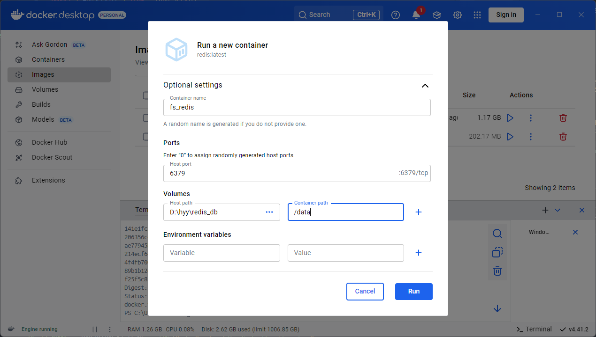

### NestJS 使用 redis

在 NestJS 项目中安装：

```bash
pnpm add redis
```

一般会对 redis 的操作单独建一个模块，后面有哪些模块需要用到 redis 直接引入即可：

```bash
nest g res cache
```

将 redis 相关配置写入 .env：

```ini
# redis配置
RD_HOST=localhost
RD_PORT=6379
```

引入 redis，自定义一个 token 为 `REDIS_CLIENT` 的 provider，同时将 CacheService 导出以供别的模块使用：

```typescript
// cache.module.ts
import { Module } from '@nestjs/common';
import { CacheService } from './cache.service';
import { ConfigService } from '@nestjs/config';
import { createClient } from 'redis';

@Module({
  providers: [
    CacheService,
    {
      provide: 'REDIS_CLIENT',
      inject: [ConfigService],
      async useFactory(configService: ConfigService) {
        const client = createClient({
          socket: {
            host: configService.get('RD_HOST'),
            port: configService.get('RD_PORT'),
          },
        });
        await client.connect();
        return client;
      },
    },
  ],
  exports: [CacheService],
})
export class CacheModule {}
```

在 `cache.service.ts` 中通过 `@Inject` 注入 `REDIS_CLIENT`，然后写一下操作 redis 的方法：

```typescript
// cache.service.ts
import { Injectable, Inject } from '@nestjs/common';
import { type RedisClientType } from 'redis';

@Injectable()
export class CacheService {
  constructor(@Inject('REDIS_CLIENT') private redisClient: RedisClientType) {}

  async get<T>(key: string) {
    const value = await this.redisClient.get(key);
    if (value === null) {
      return null;
    }
    try {
      return JSON.parse(value) as T;
    } catch (error) {
      console.log(error);
      return value;
    }
  }

  async set<T>(key: string, value: T, second?: number) {
    const serialized = JSON.stringify(value);
    return await this.redisClient.set(key, serialized, { EX: second });
  }

  async del(key: string) {
    return await this.redisClient.del(key);
  }

  // 清除缓存
  async flushAll() {
    return await this.redisClient.flushAll();
  }
}
```

由于 redis 不能存储 JS 中的对象，所以需要先转成字符串的形式，再通过 `JSON.parse` 转成对象（转不了就原样返回）

在 user.module.ts 导入：

```typescript
import { Module } from '@nestjs/common';
import { UserService } from './user.service';
import { UserController } from './user.controller';
import { TypeOrmModule } from '@nestjs/typeorm';
import { User } from './entities/user.entity';
import { CacheModule } from './cache/cache.module';

@Module({
  controllers: [UserController],
  providers: [UserService],
  imports: [TypeOrmModule.forFeature([User]), CacheModule],
})
export class UserModule {}
```

```typescript
// user.controller.ts
import { Controller, Post, Body } from '@nestjs/common';
import { UserService } from './user.service';
import { CacheService } from 'src/cache/cache.service';

@Controller('user')
export class UserController {
  constructor(
    private readonly userService: UserService,
    private cacheService: CacheService,
  ) {}

  @Post('/set')
  async setVal(@Body() val) {
    return await this.cacheService.set('name', 'hyy');
  }
}
```

连接 redis 数据库，请求` /user/set`，在 `Database Client` 可以看到：

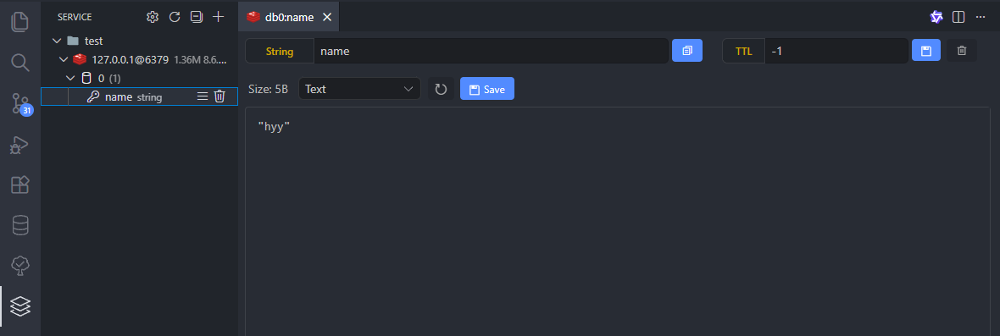

请求` /user/get` 可以看到：

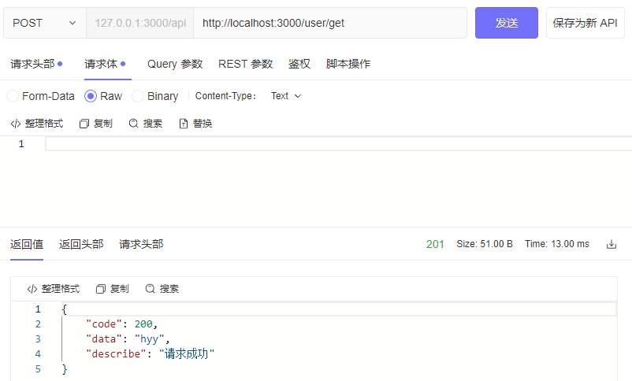


## 自动生成 Swagger 文档

安装依赖：

```bash
pnpm add @nestjs/swagger swagger-ui-express
```

在 main.ts 中：

```typescript
import { NestFactory } from '@nestjs/core';
import { SwaggerModule, DocumentBuilder } from '@nestjs/swagger';
import { AppModule } from './app.module';

async function bootstrap() {
  const app = await NestFactory.create(AppModule);

  // Swagger 配置
  const config = new DocumentBuilder()
    .setTitle('FS_ADMIN') // 标题
    .setDescription('后台管理系统接口文档') // 描述
    .setVersion('1.0') // 版本
    .build();
  const document = SwaggerModule.createDocument(app, config);
  // 配置 Swagger 地址
  SwaggerModule.setup('/docs', app, document);

  await app.listen(process.env.PORT ?? 3000);
}
bootstrap();
```

访问 http://localhost:3000/docs 就可以看到 swagger 文档了

`ApiTags` 给接口分类，`ApiOperation` 给接口添加信息

```typescript
// user.controller.ts
...
import { ApiOperation, ApiTags, ApiOkResponse } from '@nestjs/swagger';

@ApiTags('用户模块')
@Controller('user')
export class UserController {
  constructor(
    private readonly userService: UserService,
  ) {}

  @ApiOperation({
    summary: '添加用户', // 接口描述信息
  })
  @Post()
  create(@Body() createUserDto: CreateUserDto) {
    return this.userService.create(createUserDto);
  }
  ...
}
```

一般在开发中会将前端传过来的数据信息放在 `DTO` 中，而返回给前端的数据规则定义在 `VO`（`Value Object`）中

调用 swagger 的 `ApiProperty` 定义文档上的传参内容：

```typescript
// create-user.dto.ts
import { ApiProperty } from '@nestjs/swagger';

export class CreateUserDto {
  @ApiProperty({
    description: '用户名',
    example: 'admin',
  })
  username: string;

  @ApiProperty({
    description: '密码',
    example: '123456',
  })
  password: string;
}
```

新建 `user/vo/create-user.vo.ts` 描述接口的返回值：

```typescript
// create-user.vo.ts
import { ApiProperty } from '@nestjs/swagger';

export class CreateUserVo {
  @ApiProperty({ description: '状态码', example: 200 })
  code: number;

  @ApiProperty({ example: 'xxx' })
  data: string;

  @ApiProperty({ example: '请求成功' })
  description: string;
}
```

然后在 controller 中导入 swagger `ApiOkResponse` 装饰器：

```typescript
// user.controller.ts
...
import { ApiOperation, ApiTags, ApiOkResponse } from '@nestjs/swagger';
import { CreateUserVo } from './vo/create-user.vo';

@ApiTags('用户模块')
@Controller('user')
export class UserController {
  constructor(
    private readonly userService: UserService,
  ) {}

  @ApiOperation({
    summary: '添加用户', // 接口描述信息
  })
  @ApiOkResponse({
    description: '返回示例',
    type: CreateUserVo,
  })
  @Post()
  create(@Body() createUserDto: CreateUserDto) {
    return this.userService.create(createUserDto);
  }
  ...
}
```

一般有的接口需要登录才能访问，所以需要在 swagger 中设置 token，只需要在 main.ts 中添加 `addBearerAuth()` 函数：

```typescript
// Swagger 配置
const config = new DocumentBuilder()
  .setTitle('FS_ADMIN') // 标题
  .setDescription('后台管理系统接口文档') // 描述
  .setVersion('1.0') // 版本
  .addBearerAuth()
  .build();
```

然后在需要认证的接口加上 `ApiBearerAuth` 装饰器：

```typescript
// user.controller.ts
...
@ApiBearerAuth()
@ApiOperation({
  summary: '添加用户', // 接口描述信息
})
@ApiOkResponse({
  description: '返回示例',
  type: CreateUserVo,
})
@Post()
create(@Body() createUserDto: CreateUserDto) {
  return this.userService.create(createUserDto);
}
```


## 注册

NestJS 请求校验只需要在 DTO 中添加校验规则

需要安装依赖：

```bash
pnpm add class-validator class-transformer
```

在 main.ts 使用 `useGlobalPipes` 全局注册一下

```typescript
import { ValidationPipe } from '@nestjs/common';
...
app.useGlobalPipes(new ValidationPipe());
...
```

```typescript
// create-user.dto.ts
import { ApiProperty } from '@nestjs/swagger';
import { IsNotEmpty, MinLength } from 'class-validator';

export class CreateUserDto {
  @IsNotEmpty({ message: '用户名不能为空' })
  @ApiProperty({
    description: '用户名',
    example: 'admin',
  })
  username: string;

  @IsNotEmpty({ message: '密码不能为空' })
  @MinLength(6, { message: '密码不能少于6位' })
  @ApiProperty({
    description: '密码',
    example: '123456',
  })
  password: string;
}
```

请求 `/user/register` 看下返回结果：

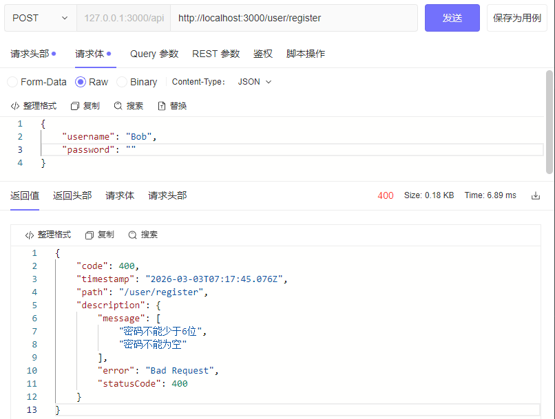

会发现 description 里面有很多额外信息，是因为 `ValidationPipe` 内部抛出错误用的是 `BadRequestException`，如果只需要 message 需要在过滤器中做下判断：

```typescript
// common/filter/http-exception.filter.ts
...
@Catch()
export class HttpExceptionFilter implements ExceptionFilter {
  catch(exception: HttpException, host: ArgumentsHost) {
    ...
    response.status(status).json({
      code: status,
      timestamp: new Date().toISOString(),
      path: request.url,
      description:
        (exception.getResponse() as BadRequestException).message ||
        exception.getResponse(),
    });
  }
}
```

一般是不能保存用户的真实密码的，这就是很多网站在忘记密码的时候会让用户重置密码而不是找回密码的原因

因此需要将密码加密后再存入数据库中，使用 crypto 进行加密：

```bash
pnpm add crypto
```

新建 `utils/crypto.ts`：

```typescript
import * as crypto from 'crypto';

export default (value: string, salt: string) =>
  crypto.pbkdf2Sync(value, salt, 1000, 18, 'sha256').toString('hex');
```

salt 在每次加密的时候都是随机的，需要存入数据库中，在登录的时候需要用到 salt 对密码加密然后跟数据库中的密码进行比对

```typescript
import { Entity, Column, PrimaryGeneratedColumn, BeforeInsert } from 'typeorm';
import encry from '../../utils/crypto';
import * as crypto from 'crypto';

@Entity('user') // 表名
export class User {
  ...
  @BeforeInsert()
  beforeInsert() {
    this.salt = crypto.randomBytes(4).toString('base64');
    this.password = encry(this.password, this.salt);
  }
}
```


## 登录

安装 `JWT`（**JSON Web Token**）：

```bash
pnpm add @nestjs/jwt
```

在 env 文件中配置 `JWT` 的密钥与过期时间：

```ini
# JWT 配置
JWT_SECRET = awesomejwt
JWT_EXP = 2h
```

在 `app.module.ts`  导入` JwtModule`：

```typescript
import { Module } from '@nestjs/common';
import { ConfigModule, ConfigService } from '@nestjs/config';
import { AppController } from './app.controller';
import { AppService } from './app.service';
import { JwtModule } from '@nestjs/jwt';

@Module({
  imports: [
    ...
    // JWT 配置
    JwtModule.registerAsync({
      global: true,
      imports: [ConfigModule],
      inject: [ConfigService],
      useFactory: (configService: ConfigService) => ({
        secret: configService.get('JWT_SECRET'),
        signOptions: {
          expiresIn: configService.get('JWT_EXP'),
        },
      }),
    }),
  ],
  controllers: [AppController],
  providers: [AppService],
})
export class AppModule {}
```

然后在 user.service.ts 中注入 JwtService ，登录成功生成 token：

```typescript
import { HttpException, HttpStatus, Injectable } from '@nestjs/common';
import { LoginDto } from './dto/login.dto';
import { InjectRepository } from '@nestjs/typeorm';
import { User } from './entities/user.entity';
import { Repository } from 'typeorm';
import { ApiException } from 'src/common/filters/http-exception/api.exception';
import { ApiErrorCode } from 'src/common/enums/api-error-code.enum';
import { JwtService } from '@nestjs/jwt';

@Injectable()
export class UserService {
  constructor(
    @InjectRepository(User)
    private userRepository: Repository<User>,
    private jwtService: JwtService,
  ) {}

  async login(loginDto: LoginDto) {
    const { username, password } = loginDto;
    // 需要先检查一下用户名是否存在
    const user = await this.findOne(username);
    if (user.password !== encry(password, user.salt)) {
      throw new ApiException('密码错误', ApiErrorCode.PASSWORD_ERROR);
    }
    const payload = { username: user.username, sub: user.id };
    return await this.jwtService.signAsync(payload);
  }

  async findOne(username: string) {
    const user = await this.userRepository.findOne({ where: { username } });
    if (!user) {
      throw new ApiException('用户名不存在', ApiErrorCode.USER_NOTEXIST);
    }
    return user;
  }
}
```

前端拿到 token 后会将 token 放在后续接口的请求头中，后端就是要验证这个 token 是否有效，无效则让前端重新登录

每个接口不可能都去做 token 验证，所以在 NestJS 中需要用到守卫 Guard 去进行拦截校验，如果验证通过则返回 true 放行，否则返回权限不足的异常

生成一个守卫：

```
nest g gu user
```

```typescript
// user.guard.ts
import {
  CanActivate,
  ExecutionContext,
  HttpException,
  HttpStatus,
  Injectable,
} from '@nestjs/common';
import { ConfigService } from '@nestjs/config';
import { JwtService } from '@nestjs/jwt';
import { Request } from 'express';

@Injectable()
export class UserGuard implements CanActivate {
  constructor(
    private jwtService: JwtService, // jwt 服务，用于验证和解析 JWT token
    private configService: ConfigService, // 配置服务，用于获取 JWT_SECRET
  ) {}

  /**
   * 判断请求是否通过身份验证
   * @param context 执行上下文
   * @returns 是否通过身份验证
   */
  async canActivate(context: ExecutionContext): Promise<boolean> {
    const request: Request = context.switchToHttp().getRequest(); // 获取请求对象
    const token = this.extractTokenFromHeader(request);
    if (!token) {
      throw new HttpException('验证不通过', HttpStatus.FORBIDDEN);
    }
    try {
      const payload = await this.jwtService.verifyAsync(token, {
        secret: this.configService.get('JWT_SECRET'), // 使用 JWT_SECRET 解析 token
      });
      request['user'] = payload; // 将解析后的用户信息存储在请求对象中
    } catch {
      throw new HttpException('token验证失败', HttpStatus.FORBIDDEN);
    }
    return true;
  }

  /**
   * 从请求头中提取 token
   * @param request 请求对象
   * @returns 提取到的 token
   */
  private extractTokenFromHeader(request: Request): string | undefined {
    const [type, token] = request.headers.authorization?.split(' ') ?? []; // 从 Authorization 头中提取 token
    return type === 'Bearer' ? token : undefined; // 如果是 Bearer 类型的 token，返回 token
  }
}
```

在 user.module.ts 引入 `APP_GUARD` 并将 `UserGuard` 注入，这样就成了全局守卫

```typescript
import { Module } from '@nestjs/common';
import { UserService } from './user.service';
import { UserController } from './user.controller';
import { TypeOrmModule } from '@nestjs/typeorm';
import { User } from './entities/user.entity';
import { APP_GUARD } from '@nestjs/core';
import { UserGuard } from './user.guard';

@Module({
  controllers: [UserController],
  providers: [
    UserService,
    {
      provide: APP_GUARD,
      useClass: UserGuard,
    },
  ],
  imports: [TypeOrmModule.forFeature([User])],
})
export class UserModule {}
```

将 user.controller.ts 中的 `@UseGuards(UserGuard)` 装饰器去掉也会生效

但是这样会将所有的接口进行验证，包括登录接口，所以还需要排除部分不需要登录验证的接口，通过自定义装饰器设置元数据的方式：

```bash
nest g d public
```

```typescript
// public.decorator.ts
import { SetMetadata } from "@nestjs/common";
export const Public = () => SetMetadata("isPublic", true);
```

在 `user.guard.ts` 中通过 `Reflector` 取出当前的 isPublic，如果为 true 代表用了 @Public 装饰过，则不需要判断直接放行：

```typescript
...
import { Reflector } from '@nestjs/core';

@Injectable()
export class UserGuard implements CanActivate {
  constructor(
    private reflector: Reflector,
  ) {}
    
  async canActivate(context: ExecutionContext): Promise<boolean> {
    const isPublic = this.reflector.getAllAndOverride<boolean>('isPublic', [
      // 即将调用的方法
      context.getHandler(),
      // controller 类型
      context.getClass(),
    ]);
    if (isPublic) {
      return true;
    }
  }
}
```

然后在不需要 token 的接口上加上自定义的装饰器：

```typescript
...
@Post('register')
@Public()
create(@Body() createUserDto: CreateUserDto) {
  return this.userService.create(createUserDto);
}

@Post('login')
@Public()
login(@Body() loginDto: LoginDto) {
  return this.userService.login(loginDto);
}
```

请求注册登录接口不会触发 token 验证，其他接口则会


### 图形验证码

当用户请求验证码接口时，后端将一个随机字符串生成一个图片，同时随机生成一个 id 与当前用户关联，然后以 id 为 key 将随机字符存入 redis 或 session 中，当用户注册或登录的时候带上这个 id 和图片上的字符，后端再通过 redis 取值判断即可

安装生成随机字符图片的包 svg-captcha：

```typescript
pnpm add svg-captcha
```

新建 utils/generateCaptcha.ts 写一个生成图片验证码和随机字符 id 的函数：

```typescript
import { create } from 'svg-captcha';
import * as crypto from 'crypto';

export default () => {
  const captcha = create({
    size: 4, // 生成字符数
    ignoreChars: 'Il', // 过滤字符
    noise: 2, // 干扰线数量
    background: '#999', // 背景色
    color: true, // 字体颜色是否随机生成
    width: 100,
    height: 40,
  });
  const id = crypto.randomBytes(10).toString('hex');
  return { captcha, id };
};
```

```typescript
// user.controller.ts
...
@Get('captcha')
@Public()
getCaptcha() {
  return this.userService.getCaptcha();
}
```

```typescript
// user.service.ts
...
import generateCaptcha from 'src/utils/generateCaptcha';

getCaptcha() {
  const { id, captcha } = generateCaptcha();
  return { id, captcha };
}
```

请求一下：

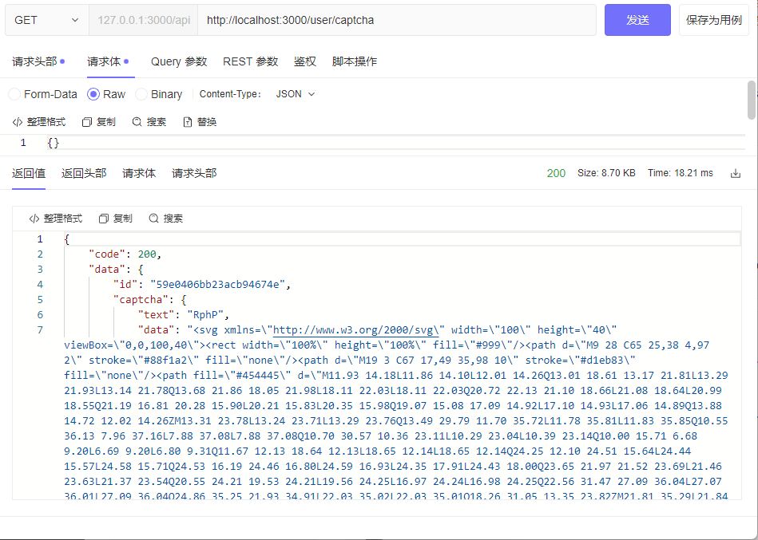

将图片中的字符缓存到 redis 中，在 user.module.ts 中导入 redis 缓存模块：

```typescript
...
import { CacheModule } from '../cache/cache.module';

@Module({
  ...
  imports: [TypeOrmModule.forFeature([User]), CacheModule],
})
```

然后就可以在 user.service.ts 中注入使用了：

```typescript
...
import { CacheService } from 'src/cache/cache.service';

@Injectable()
export class UserService {
  constructor(
    @InjectRepository(User)
    private cacheService: CacheService,
  ) {}
  
  async getCaptcha() {
    const { id, captcha } = generateCaptcha();
    await this.cacheService.set(id, captcha.text, 60);
    return { id, captcha };
  }
  ...
}
```

然后在注册和登录的 dto 中加上 id 和 captcha 字段：

```typescript
import { ApiProperty } from '@nestjs/swagger';
import { IsNotEmpty, Length, MinLength } from 'class-validator';

export class CreateUserDto {
  @IsNotEmpty({ message: '用户名不能为空' })
  @ApiProperty({
    example: 'admin',
    description: '用户名',
  })
  username: string;

  @IsNotEmpty({ message: '密码不能为空' })
  @MinLength(6, { message: '密码不能少于6位' })
  @ApiProperty({
    example: '123456',
    description: '密码',
  })
  password: string;

  @IsNotEmpty({ message: 'id不能为空' })
  @ApiProperty({
    example: 'xxx',
    description: 'id',
  })
  id: string;

  @Length(4, 4, { message: '验证码必须4位' })
  @ApiProperty({
    example: 'aB12',
    description: '验证码',
  })
  captcha: string;
}
```

注册和登录的时候加上验证码判断：

```typescript
// user.service.ts
...
async checkCaptcha(id: string, captcha: string) {
  // 缓存的验证码
  const cachedCaptcha = await this.cacheService.get(id);
  if (captcha !== cachedCaptcha) {
    throw new ApiException('验证码错误', ApiErrorCode.COMMON_CODE);
  }
}

async login(loginDto: LoginDto) {
  const { username, password, id, captcha } = loginDto;
  await this.checkCaptcha(id, captcha);
  ...
}
```


## token 续期

假设用户一直在操作页面调用接口，咔一下 token 到期了，一调用接口直接触发 token 校验提交需要重新登录，不合适吧？

用户登录以 `{token: token}` 的形式存入 redis，并将 token 返回给前端

验证 token 的时候根据前端传来的 token 与 redis 中的 token 进行 JWT 校验并获取到 token 过期时间

当 `过期时间 - 当前时间 < 某个值` 的时候重新进行 JWT 注册生成新的 token，并以 `{toekn: newToken}` 的形式存入 redis 中

```typescript
// user.guard.ts
import {
  CanActivate,
  ExecutionContext,
  HttpException,
  HttpStatus,
  Injectable,
} from '@nestjs/common';
import { ConfigService } from '@nestjs/config';
import { Reflector } from '@nestjs/core';
import { JwtService } from '@nestjs/jwt';
import { Request } from 'express';
import { CacheService } from 'src/cache/cache.service';

interface JwtPayload {
  username: string;
  sub: string | number;
  exp: number;
  iat?: number;
}

@Injectable()
export class UserGuard implements CanActivate {
  constructor(
    private jwtService: JwtService, // jwt 服务，用于验证和解析 JWT token
    private configService: ConfigService, // 配置服务，用于获取 JWT_SECRET
    private cacheService: CacheService, // redis 缓存服务
    private reflector: Reflector,
  ) {}

  /**
   * 判断请求是否通过身份验证
   * @param context 执行上下文
   * @returns 是否通过身份验证
   */
  async canActivate(context: ExecutionContext): Promise<boolean> {
    const isPublic = this.reflector.getAllAndOverride<boolean>('isPublic', [
      // 即将调用的方法
      context.getHandler(),
      // controller 类型
      context.getClass(),
    ]);
    if (isPublic) {
      return true;
    }

    const request: Request = context.switchToHttp().getRequest(); // 获取请求对象
    const token = this.extractTokenFromHeader(request);
    if (!token) {
      throw new HttpException('验证不通过', HttpStatus.FORBIDDEN);
    }
    const realToken = await this.cacheService.get(token);
    try {
      const payload = await this.jwtService.verifyAsync<JwtPayload>(
        realToken as string,
        {
          secret: this.configService.get('JWT_SECRET'), // 使用 JWT_SECRET 解析 token
        },
      );
      // 获取 token 过期时间
      const { exp } = payload;
      const nowTime = Math.floor(new Date().getTime() / 1000);
      const isExpired = exp - nowTime < this.configService.get('TOKEN_EXP');
      if (isExpired) {
        const newPayload = { username: payload.username, sub: payload.sub };
        const newToken = await this.jwtService.signAsync(newPayload);
        await this.cacheService.set(token, newToken, 7200);
      }
      request['user'] = payload; // 将解析后的用户信息存储在请求对象中
    } catch {
      throw new HttpException('token验证失败', HttpStatus.FORBIDDEN);
    }
    return true;
  }

  /**
   * 从请求头中提取 token
   * @param request 请求对象
   * @returns 提取到的 token
   */
  private extractTokenFromHeader(request: Request): string | undefined {
    const [type, token] = request.headers.authorization?.split(' ') ?? []; // 从 Authorization 头中提取 token
    return type === 'Bearer' ? token : undefined; // 如果是 Bearer 类型的 token，返回 token
  }
}
```


## RBAC

Role Based Access Control（基于角色的权限控制）

### 创建表

生成菜单模块和菜单表：

```
nest g res menu
```

```typescript
// menu.entity.ts
import {
  Entity,
  Column,
  CreateDateColumn,
  PrimaryGeneratedColumn,
} from 'typeorm';

@Entity('menu')
export class Menu {
  @PrimaryGeneratedColumn()
  id: number;

  @Column({ length: 20 })
  title: string; // 标题

  @Column()
  order_num: number; // 排序

  @Column({ nullable: true })
  parent_id: number; // 父 id

  @Column()
  menu_type: number; // 菜单类型 1:目录 2:菜单 3:按钮

  @Column({
    length: 50,
    nullable: true,
  })
  icon: string; // 图标

  @Column({
    length: 50,
    nullable: true,
  })
  component: string; // 组件路径

  @Column({
    length: 50,
    nullable: true,
  })
  permission: string; // 权限标识

  @Column({
    length: 50,
  })
  path: string; // 路由

  @Column({
    type: 'bigint',
  })
  create_by: number;

  @Column({
    default: 1,
  })
  status: number; // 状态 1：启用 0：禁用

  @CreateDateColumn()
  create_time: Date;

  @CreateDateColumn()
  update_time: Date;
}
```

之前每创建一个表都要导入一次实体，这里到 app.module.ts 中设置：

```typescript
...
// TypeORM 配置
TypeOrmModule.forRootAsync({
  imports: [ConfigModule],
  inject: [ConfigService],
  useFactory: (configService: ConfigService) => ({
    type: 'mysql',
    host: configService.get('DB_HOST'),
    port: configService.get('DB_PORT'),
    username: configService.get('DB_USERNAME', 'root'),
    password: configService.get('DB_PASSWORD', 'root'),
    database: configService.get('DB_DATABASE', 'nest_test'),
    // entities: [User],
    entities: ['**/*.entity.js'], // 自动查找后缀为 .entity.js 文件自动加载创建表
    autoLoadEntities: true,
    synchronize: configService.get('NODE_ENV') === 'development',
    connectorPackage: 'mysql2', // 驱动包
  }),
}),
```

启动项目，会自动建表

同样生成角色模块和角色表：

```
nest g res role
```

```typescript
// role.entity.ts
import {
  Column,
  CreateDateColumn,
  Entity,
  JoinTable,
  ManyToMany,
  PrimaryGeneratedColumn,
} from 'typeorm';
import { Menu } from 'src/menu/entities/menu.entity';

@Entity('role')
export class Role {
  @PrimaryGeneratedColumn({
    type: 'bigint',
  })
  id: string; // 角色 id

  @Column({
    length: 20,
  })
  role_name: string; // 角色名

  @Column()
  role_sort: number; // 排序

  @Column({
    default: 1,
  })
  status: number; // 角色状态 1：启用 0：关闭

  @Column({
    length: 100,
    nullable: true,
  })
  remark: string; // 备注

  @Column({
    type: 'bigint',
  })
  create_by: number; // 创建人 id

  @Column({
    type: 'bigint',
  })
  update_by: number; // 更新人 id

  @CreateDateColumn()
  create_time: Date;

  @CreateDateColumn()
  update_time: Date;

  @ManyToMany(() => Menu)
  @JoinTable({
    name: 'role_menu_relation',
  })
  menus: Menu[];
}
```

使用 `@ManyToMany(() => Menu)` 和菜单表实现多对多的关系,因为一个角色可以有多个菜单，一个菜单也可以有多个角色。启动项目 nest 会创建一个 role 表和一个 `role_menu_relation` 关系表

除了角色和菜单，用户和角色也是多对多的关系，需要修改一下 user 实体：

```typescript
// user.entity.ts
...
import { Role } from 'src/role/entities/role.entity';

@Entity('user')
export class User {
  ...
  @ManyToMany(() => Role)
  @JoinTable({
    name: 'user_role_relation',
  })
  roles: Role[];
}
```

### 新增菜单

开发新增菜单接口，包含系统管理、角色管理、菜单管理、用户管理

在 menu 模块新建 dto/create-menu.dto.ts 规定前端传过来的参数：

```typescript
import { ApiProperty } from '@nestjs/swagger';
import { IsNotEmpty, IsOptional } from 'class-validator';

export class CreateMenuDto {
  @IsNotEmpty({ message: '菜单名不能为空' })
  title: string;

  @ApiProperty({
    example: 1,
    required: false,
  })
  order_num: number;

  @IsOptional()
  @ApiProperty({
    example: 1,
  })
  parent_id?: number;

  @ApiProperty({
    example: 1,
  })
  menu_type: number;

  @ApiProperty({
    example: 'home',
  })
  icon: string;

  @IsOptional()
  @ApiProperty({
    example: 'AA/BB',
    required: false,
  })
  component?: string;

  @IsNotEmpty({ message: '路由不能为空' })
  @ApiProperty({
    example: 'BB',
  })
  path: string;

  @ApiProperty({
    example: 101,
  })
  create_by: number;

  @IsOptional()
  @ApiProperty({
    example: 'sys:post:list',
    required: false,
  })
  permission?: string;
}
```

然后在 menu.module.ts 中 引入 menu 的实体并注入：

```typescript
import { Module } from '@nestjs/common';
import { MenuService } from './menu.service';
import { MenuController } from './menu.controller';
import { TypeOrmModule } from '@nestjs/typeorm';
import { Menu } from './entities/menu.entity';
import { User } from 'src/user/entities/user.entity';

@Module({
  controllers: [MenuController],
  providers: [MenuService],
  imports: [TypeOrmModule.forFeature([Menu, User])],
})
export class MenuModule {}
```

然后在 `menu.service.ts` 通过 `@InjectRepository` 装饰器中注入到参数中就可以操作这个表了：

```typescript
import { Injectable } from '@nestjs/common';
import { InjectRepository } from '@nestjs/typeorm';
import { Repository } from 'typeorm';
import { Menu } from './entities/menu.entity';
import { User } from 'src/user/entities/user.entity';
import { CreateMenuDto } from './dto/create-menu.dto';
import { ApiException } from 'src/common/filters/http-exception/api.exception';
import { ApiErrorCode } from 'src/common/enums/api-error-code.enum';

@Injectable()
export class MenuService {
  constructor(
    @InjectRepository(Menu)
    private readonly menuRepository: Repository<Menu>,

    @InjectRepository(User)
    private readonly userRepository: Repository<Menu>,
  ) {}

  async createMenu(createMenuDto: CreateMenuDto) {
    try {
      await this.menuRepository.save(createMenuDto);
      return '新增菜单成功';
    } catch {
      throw new ApiException('新增菜单失败', ApiErrorCode.COMMON_CODE);
    }
  }
}
```

在 controller 中定义一个路由调用：

```typescript
// menu.controller.ts
import { Controller, Post, Body } from '@nestjs/common';
import { MenuService } from './menu.service';
import { ApiTags, ApiParam, ApiOperation } from '@nestjs/swagger';
import { CreateMenuDto } from './dto/create-menu.dto';

@Controller('menu')
@ApiTags('菜单权限模块')
export class MenuController {
  constructor(private readonly menuService: MenuService) {}

  @Post('createMenu')
  @ApiParam({ name: 'createMenuDto', type: CreateMenuDto })
  @ApiOperation({ summary: '新增菜单' })
  async createMenu(@Body() createMenuDto: CreateMenuDto) {
    return await this.menuService.createMenu(createMenuDto);
  }
}
```

### 新增角色、用户

先创建 dto 规定前端传的参数：

```typescript
import { IsArray, IsNotEmpty, IsNumber, IsOptional } from 'class-validator';
import { ApiProperty } from '@nestjs/swagger';

export class CreateRoleDto {
  @IsNotEmpty({ message: '角色名不可为空' })
  @ApiProperty({
    example: '技术人员',
  })
  role_name: string;

  @IsOptional()
  @ApiProperty({
    example: '备注',
    required: false,
  })
  remark?: string;

  @IsNotEmpty({ message: '角色状态不可为空' })
  @ApiProperty({
    example: 1,
    description: '角色状态，1表示启用，0表示禁用',
  })
  status: number;

  @IsOptional()
  @IsNumber({}, { each: true, message: 'role_ids必须是数字数组' })
  @IsArray({
    message: 'role_ids必须是数组',
  })
  @ApiProperty({
    example: [1],
    required: false,
  })
  role_ids?: number[];

  @IsNotEmpty({ message: '排序不可为空' })
  @ApiProperty({
    example: 1,
  })
  role_sort: number;

  @IsNotEmpty({ message: '创建人id不可为空' })
  @ApiProperty({
    example: 1,
  })
  create_by: number;

  @IsNotEmpty({ message: '更新人id不可为空' })
  @ApiProperty({
    example: 1,
  })
  update_by: number;
}
```

在 role.module.ts 导入 menu 和 role 表的实体：

```typescript
...
import { Role } from './entities/role.entity';
import { Menu } from 'src/menu/entities/menu.entity';

@Module({
  ...
  imports: [TypeOrmModule.forFeature([Role, Menu])],
})
export class RoleModule {}
```

在 role.service.ts 中写创建角色的逻辑：

```typescript
import { Injectable } from '@nestjs/common';
import { InjectRepository } from '@nestjs/typeorm';
import { In, Repository } from 'typeorm';
import { Role } from './entities/role.entity';
import { Menu } from 'src/menu/entities/menu.entity';
import { CreateRoleDto } from './dto/create-role.dto';
import { ApiException } from 'src/common/filters/http-exception/api.exception';
import { ApiErrorCode } from 'src/common/enums/api-error-code.enum';

@Injectable()
export class RoleService {
  constructor(
    @InjectRepository(Role)
    private readonly roleRepository: Repository<Role>,

    @InjectRepository(Menu)
    private readonly menuRepository: Repository<Menu>,
  ) {}

  async create(createRoleDto: CreateRoleDto) {
    const row = await this.roleRepository.findOne({
      where: { role_name: createRoleDto.role_name },
    });
    if (row) {
      throw new ApiException('角色已存在', ApiErrorCode.COMMON_CODE);
    }
    const newRole = new Role();
    if (createRoleDto.menu_ids?.length) {
      // 查询包含 menu_ids 的菜单列表
      const menuList = await this.menuRepository.find({
        where: {
          id: In(createRoleDto.menu_ids),
        },
      });
      // 赋值给 newRole（插入表中之后就会在关系表中生成对应关系）
      newRole.menus = menuList;
    }
    try {
      await this.roleRepository.save({ ...newRole, ...createRoleDto });
      return 'success';
    } catch {
      throw new ApiException('系统异常', ApiErrorCode.FAIL);
    }
  }
}
```

在 role.controller.ts 中调用：

```typescript
import { Controller, Post, Body } from '@nestjs/common';
import { RoleService } from './role.service';
import { ApiParam, ApiTags } from '@nestjs/swagger';
import { Public } from 'src/common/decorators/public.decorator';
import { CreateRoleDto } from './dto/create-role.dto';

@Controller('role')
@ApiTags('角色模块')
export class RoleController {
  constructor(private readonly roleService: RoleService) {}

  @Public()
  @Post('createRole')
  @ApiParam({
    name: 'createRoleDto',
    type: CreateRoleDto,
  })
  createRole(@Body() createRoleDto: CreateRoleDto) {
    return this.roleService.create(createRoleDto);
  }
}
```

通过调用接口 /role/createRole 创建两个角色：

超级管理员 admin

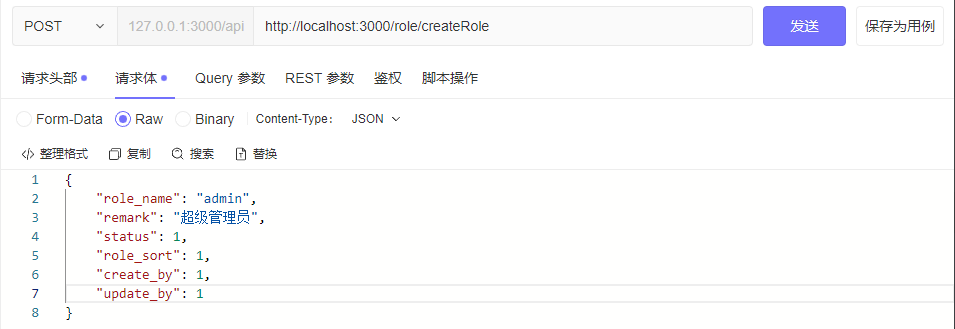

普通管理员 角色1

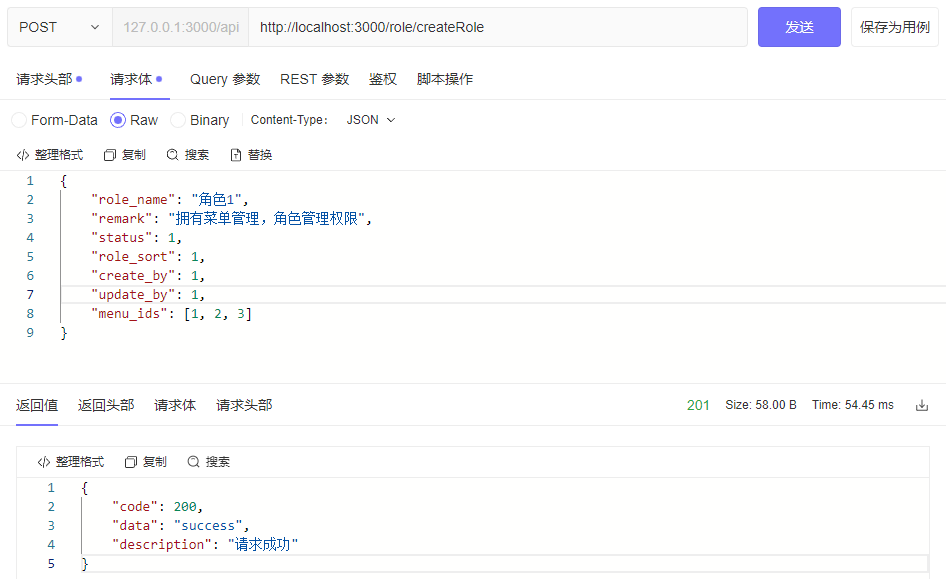

同样的逻辑，在 user 模块用中加一个创建用户的接口：

```typescript
import { HttpException, HttpStatus, Injectable } from '@nestjs/common';
import { CreateUserDto } from './dto/create-user.dto';
import { InjectRepository } from '@nestjs/typeorm';
import { Repository, In } from 'typeorm';
import { ApiException } from 'src/common/filters/http-exception/api.exception';
import { ApiErrorCode } from 'src/common/enums/api-error-code.enum';
import encry from '../utils/crypto';
...

import { User } from './entities/user.entity';
import { Role } from 'src/role/entities/role.entity';

@Injectable()
export class UserService {
  constructor(
    @InjectRepository(User)
    private userRepository: Repository<User>,
    @InjectRepository(Role)
    private roleRepository: Repository<Role>,
    ...
  ) {}
  ...

  async create(createUserDto: CreateUserDto) {
    const { username, password, id, captcha } = createUserDto;

    const existUser = await this.userRepository.findOne({
      where: { username: createUserDto.username },
    });
    if (existUser) {
      throw new ApiException('用户已存在', ApiErrorCode.USER_EXIST);
    }
      
    const newUser = new User();
    // 在 User entity 中，username 和 password 都是必需字段，如果不赋值，保存到数据库时会因为违反 NOT NULL 约束而失败
    newUser.username = createUserDto.username;
    newUser.password = createUserDto.password;
    if (createUserDto.role_ids?.length) {
      // 查询需要绑定的角色列表（自动在关联表生成关联关系）
      const roleList = await this.roleRepository.find({
        where: {
          id: In(createUserDto.role_ids),
        },
      });
      newUser.roles = roleList;
    }
    try {
      await this.userRepository.save(newUser);
      return '创建用户成功';
    } catch {
      throw new ApiException('创建用户失败', ApiErrorCode.FAIL);
    }
  }

  async findOne(username: string) {
    const user = await this.userRepository.findOne({ where: { username } });
    if (!user) {
      throw new ApiException('用户名不存在', ApiErrorCode.USER_NOTEXIST);
    }
    return user;
  }
}
```

user.controller.ts 中：

```typescript
...
@Post('createUser')
@Public()
@ApiOperation({ summary: '用户管理-新增' })
@ApiOkResponse({
  description: '返回示例',
  type: CreateUserVo,
})
create(@Body() createUserDto: CreateUserDto) {
  return this.userService.create(createUserDto);
}
```

然后新增两个用户，并赋予 管理员 和 角色1 角色：

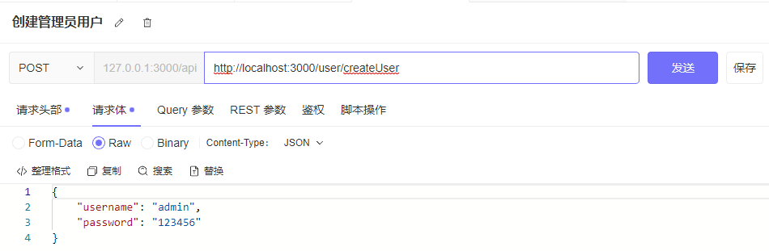

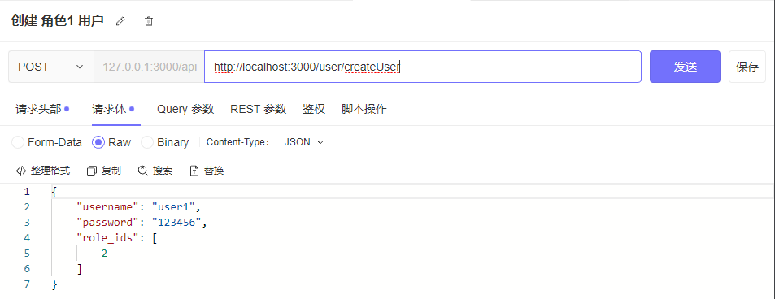

### 获取路由菜单

在 menu.service.ts 中：

```typescript
import { Injectable } from '@nestjs/common';
import { InjectRepository } from '@nestjs/typeorm';
import { Repository } from 'typeorm';
import { Menu } from './entities/menu.entity';
import { User } from 'src/user/entities/user.entity';
import { ApiException } from 'src/common/filters/http-exception/api.exception';
import { ApiErrorCode } from 'src/common/enums/api-error-code.enum';
import { AuthenticatedRequest } from 'src/common/interfaces/auth-request.interface';
import { Role } from 'src/role/entities/role.entity';
import { convertToTree } from 'src/utils/tree';

@Injectable()
export class MenuService {
  constructor(
    @InjectRepository(Menu)
    private readonly menuRepository: Repository<Menu>,

    @InjectRepository(User)
    private readonly userRepository: Repository<User>,
  ) {}

  async getRouters(req: AuthenticatedRequest) {
    // user.guard 中注入的解析后的 JWTToken 的 user
    const { user } = req;
    // 根据关联关系通过 user 查询 user 下的菜单和角色
    const userList = await this.userRepository
      .createQueryBuilder('user')
      .leftJoinAndSelect('user.roles', 'role')
      .leftJoinAndSelect('role.menus', 'menu')
      .where({ id: user.sub })
      .orderBy('menu.order_num', 'ASC')
      .getOne();

    // 是否为超级管理员，是则返回所有菜单，否则返回用户关联的菜单
    const isAdmin = userList?.roles?.find((item) => item.role_name === 'admin');
    let routers: Menu[] = [];

    if (isAdmin) {
      routers = await this.menuRepository.find({
        order: {
          order_num: 'ASC',
        },
        where: {
          status: 1,
        },
      });
      return convertToTree(routers);
    }
    interface MenuMap {
      [key: string]: Menu;
    }

    // 根据 id 去重
    const menus: MenuMap =
      userList?.roles.reduce((mergedMenus: MenuMap, role: Role) => {
        role.menus.forEach((menu) => {
          mergedMenus[menu.id] = menu;
        });
        return mergedMenus;
      }, {}) || {};

    routers = Object.values(menus);
    return convertToTree(routers);
  }
}
```

convertToTree 将扁平数组转化为树形结构数组：

```typescript
// src/utils/tree.ts
import { Menu } from 'src/menu/entities/menu.entity';

/**
 * Convert a flat array of menus into a tree structure
 * @param menus - Flat array of menu items
 * @param parentId - Parent ID to start building the tree from (default: null for root items)
 * @returns Tree-structured array of menus with children
 */
export interface MenuTree extends Menu {
  children?: MenuTree[];
}

export function convertToTree(
  menus: Menu[],
  parentId: number | null = null,
): MenuTree[] {
  const tree: MenuTree[] = [];

  menus.forEach((menu) => {
    if (menu.parent_id === parentId) {
      const children = convertToTree(menus, menu.id);
      const menuWithChildren: MenuTree = { ...menu };

      if (children.length > 0) {
        menuWithChildren.children = children;
      }

      tree.push(menuWithChildren);
    }
  });

  return tree;
}
```

common/interfaces/auth-request.interface.ts

```typescript
import { Request } from 'express';

export interface JwtPayload {
  username: string;
  sub: string | number;
  exp: number;
  iat?: number;
}

export interface AuthenticatedRequest extends Request {
  user: JwtPayload;
}
```

最后在 menu.controller.ts 中定义一个路由：

```typescript
import type { AuthenticatedRequest } from 'src/common/interfaces/auth-request.interface';

@Post('/getRouters')
@ApiOperation({ summary: '获取路由' })
async getRouters(@Request() req: AuthenticatedRequest) {
  return await this.menuService.getRouters(req);
}
```


## 接口按钮权限控制

自定义装饰器 src/common/decorators/permissions.decorator.ts：

```typescript
import { SetMetadata } from '@nestjs/common';

export const Permissions = (...permissions: string[]) =>
  SetMetadata('permissions', permissions);
```

导航守卫 src/common/guards/permissions.guard.ts：

```typescript
import { CanActivate, ExecutionContext, Injectable } from '@nestjs/common';
import { Reflector } from '@nestjs/core';
import { Observable } from 'rxjs';
import { CacheService } from 'src/cache/cache.service';
import {
  AuthenticatedRequest,
  JwtPayload,
} from 'src/common/interfaces/auth-request.interface';

@Injectable()
export class PermissionsGuard implements CanActivate {
  constructor(
    private reflector: Reflector, // 注入 Reflector 来获取元数据

    private cacheService: CacheService, // 注入 CacheService 来获取用户权限缓存
  ) {}

  canActivate(
    context: ExecutionContext,
  ): boolean | Promise<boolean> | Observable<boolean> {
    // 获取自定义装饰器配置的元数据 permissions
    const requiredPermissions = this.reflector.get<string[]>(
      'permissions',
      context.getHandler(),
    );

    // 如果没有配置 permissions，默认允许访问
    if (!requiredPermissions) {
      return true;
    }
    // 获取当前请求的用户信息（全局守卫 UserGuard 已经将用户信息挂载到 request 上）
    const request = context.switchToHttp().getRequest<AuthenticatedRequest>();
    const { user } = request;

    // 检查用户是否具有所需的权限
    return this.checkPermissions(user, requiredPermissions);
  }

  private async checkPermissions(
    user: JwtPayload,
    requiredPermissions: string[],
  ) {
    // 从缓存中获取用户的权限列表
    const userPermissions = await this.cacheService.get<string[]>(
      `permissions_${user.sub}`,
    );
    // 如果用户未登录或未设置权限，拒绝访问
    if (!user || !userPermissions) {
      return false;
    }
    // 检查用户是否具有所需的权限
    return requiredPermissions.every((permission) =>
      userPermissions.includes(permission),
    );
  }
}
```

可以将 Redis 模块改成全局模块，这样在其他 service 中使用这个守卫就不用再导入 CacheModule 了：

```typescript
// cache.module.ts
import { Module, Global } from '@nestjs/common';
import { CacheService } from './cache.service';
import { ConfigService } from '@nestjs/config';
import { createClient } from 'redis';

// 使用 @Global() 装饰器将模块设置为全局模块
@Global()
@Module({
  providers: [
    CacheService,
    {
      provide: 'REDIS_CLIENT',
      inject: [ConfigService],
      async useFactory(configService: ConfigService) {
        const client = createClient({
          socket: {
            host: configService.get('RD_HOST'),
            port: configService.get('RD_PORT'),
          },
        });
        await client.connect();
        return client;
      },
    },
  ],
  exports: [CacheService],
})
export class CacheModule {}
```

获取用户信息接口 getInfo，返回权限列表和路由列表

```typescript
...
import { AuthenticatedRequest } from 'src/common/interfaces/auth-request.interface';
import { Role } from 'src/role/entities/role.entity';
import { convertToTree } from 'src/utils/tree';
import { CacheService } from 'src/cache/cache.service';
import { filterPermissions } from 'src/utils/filterPermissions';

@Injectable()
export class MenuService {
  constructor(
    @InjectRepository(Menu)
    private readonly menuRepository: Repository<Menu>,

    @InjectRepository(User)
    private readonly userRepository: Repository<User>,

    private cacheService: CacheService,
  ) {}

  async getInfo(req: AuthenticatedRequest) {
    // user.guard 中注入的解析后的 JWTToken 的 user
    const { user } = req;
    // 根据关联关系通过 user 查询 user 下的菜单和角色
    const userList = await this.userRepository
      .createQueryBuilder('user')
      .leftJoinAndSelect('user.roles', 'role')
      .leftJoinAndSelect('role.menus', 'menu')
      .where({ id: user.sub })
      .orderBy('menu.order_num', 'ASC')
      .getOne();

    // 是否为超级管理员，是则返回所有菜单，否则返回用户关联的菜单
    const isAdmin = userList?.roles?.find((item) => item.role_name === 'admin');
    let routers: Menu[] = [];
    let permissions: string[] = [];
    if (isAdmin) {
      routers = await this.menuRepository.find({
        order: {
          order_num: 'ASC',
        },
        where: {
          status: 1,
        },
      });
      // 获取菜单所拥有的权限
      permissions = filterPermissions(routers);
      // 存储当前用户的权限
      await this.cacheService.set(`permissions_${user.sub}`, permissions, 3600);
      return {
        routers: convertToTree(routers),
        permissions,
      };
    }
    interface MenuMap {
      [key: string]: Menu;
    }

    // 根据 id 去重
    const menus: MenuMap =
      userList?.roles.reduce((mergedMenus: MenuMap, role: Role) => {
        role.menus.forEach((menu) => {
          mergedMenus[menu.id] = menu;
        });
        return mergedMenus;
      }, {}) || {};

    routers = Object.values(menus);
    permissions = filterPermissions(routers);
    await this.cacheService.set(`permissions_${user.sub}`, permissions, 7200);
    return {
      routers: convertToTree(routers),
      permissions,
    };
  }
}
```

utils/filterPermissions.ts

```typescript
import { Menu } from 'src/menu/entities/menu.entity';

// 从菜单列表中提取权限字符串，并去重
export const filterPermissions = (routers: Menu[]): string[] => {
  return [
    ...new Set(
      routers
        .map((router) => router.permission)
        .filter((permission) => !!permission),
    ),
  ];
};
```

在数据库中手动插入几个权限字段测试：

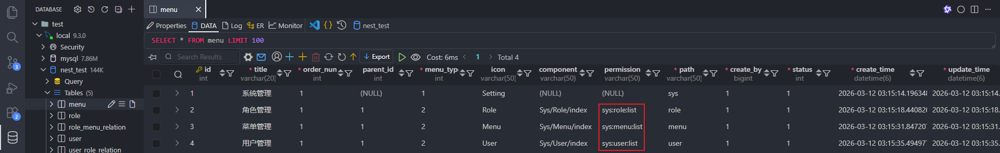

然后登录 user1 请求 /menu/getInfo 就拿到了拥有的菜单和权限字段：

```json
{
    "code": 200,
    "data": {
        "routers": [
            {
                "id": 1,
                "title": "系统管理",
                "order_num": 1,
                "parent_id": null,
                "menu_type": 1,
                "icon": "Setting",
                "component": null,
                "permission": null,
                "path": "sys",
                "create_by": "1",
                "status": 1,
                "create_time": "2026-03-11T19:15:14.196Z",
                "update_time": "2026-03-11T19:15:14.196Z",
                "children": [
                    {
                        "id": 2,
                        "title": "角色管理",
                        "order_num": 1,
                        "parent_id": 1,
                        "menu_type": 2,
                        "icon": "Role",
                        "component": "Sys/Role/index",
                        "permission": "sys:role:list",
                        "path": "role",
                        "create_by": "1",
                        "status": 1,
                        "create_time": "2026-03-11T19:15:18.440Z",
                        "update_time": "2026-03-11T19:15:18.440Z"
                    },
                    {
                        "id": 3,
                        "title": "菜单管理",
                        "order_num": 1,
                        "parent_id": 1,
                        "menu_type": 2,
                        "icon": "Menu",
                        "component": "Sys/Menu/index",
                        "permission": "sys:menu:list",
                        "path": "menu",
                        "create_by": "1",
                        "status": 1,
                        "create_time": "2026-03-11T19:15:31.847Z",
                        "update_time": "2026-03-11T19:15:31.847Z"
                    }
                ]
            }
        ],
        "permissions": [
            "sys:role:list",
            "sys:menu:list"
        ]
    },
    "description": "请求成功"
}
```

在 menu.controller.ts 中进一步测试：

```typescript
import { PermissionsGuard } from 'src/common/guards/permissions.guard';
import { Permissions } from 'src/common/decorators/permissions.decorator';
...
@Post('test')
@UseGuards(PermissionsGuard)
@Permissions('sys:menu:list')
test() {
  return 'success';
}
```

请求 /menu/test

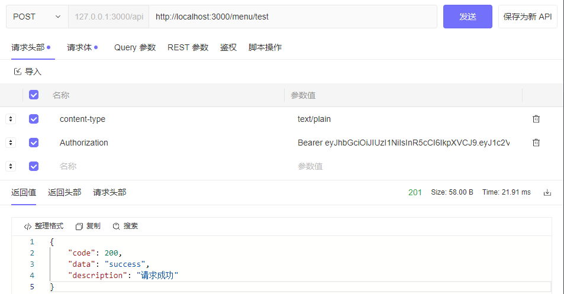

如果配置 `@Permissions('sys:user:list')` 则请求会报 403，因为 user1 没有这个权限


## 菜单管理和角色管理

菜单管理和角色管理页面 CRUD

### 新增菜单

```typescript
...
@Post('createMenu')
@Permissions('system:menu:add')
@ApiOperation({ summary: '菜单管理-新增' })
@ApiParam({ name: 'createMenuDto', type: CreateMenuDto })
async createMenu(@Body() createMenuDto: CreateMenuDto) {
  return await this.menuService.createMenu(createMenuDto);
}
```

在权限守卫 guards/permissions.guard.ts 中给管理员用户放行

```

```

### 新增角色

和新增菜单不同的是，新增角色前端需要传入菜单权限列表 menu_ids，然后根据 menu_ids 查到菜单列表，再将菜单列表和角色关联