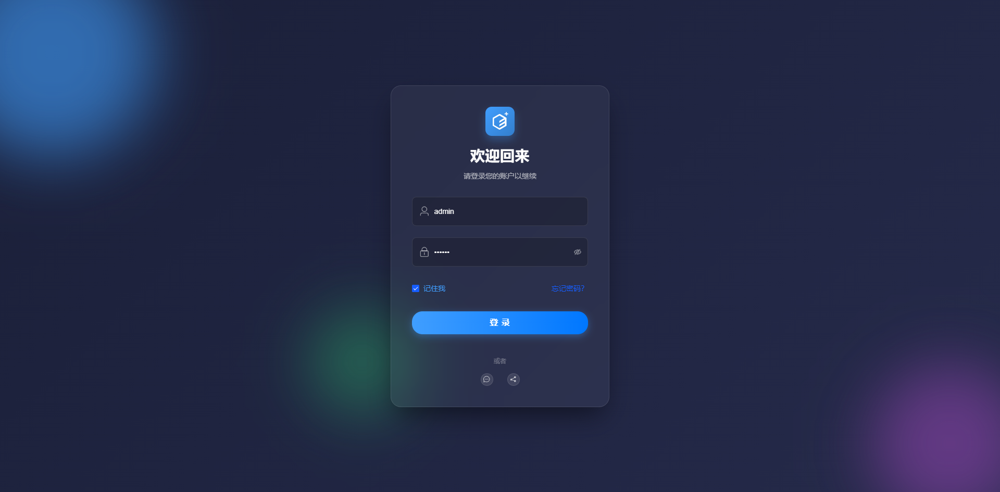

# Vue 3 + Vite + ElementPlus + JavaScript 后台管理系统模板

## 废话写在前面

对于咱这些在小公司摸爬滚打（混吃等死）的前端胶水工程师来说，经常面对的业务就是各种纷繁复杂（大差不差）的后台管理系统了，以前是 Vue2 + ElementUI 一把梭，现在都 2025 年了，AI 都不写公元前的那一套了，咱再不动一动挪一挪，那真有点说不过去了，新项目还是上点略新一点的活整整吧

话说小公司讲究一个什么，那就是不讲究，额额，讲究一个快速开发业务，这里就不得不提一下 JavaScript 最初的灵活性了，用 TypeScript 总感觉有点自缚手脚，大炮打苍蝇的赶脚，而且就砸门那两碗水，写到最后也是 anyScript。所以还是使用 JavaScript 吧，不过该有的规范还是得有的，不然成石山了扣到咱头上也不好处理不是

ok 话不多杯，准备开整！（进入正题就不废话了，什么？你问我前面为啥要废话，废话，不是废话正经人谁看啊）

---


## 创建项目

环境准备：

- nodejs 版本：建议大于 20
- 使用 pnpm
- VSCode 插件 - Vue (Official)

找一个看得顺眼的目录执行命令：

```bash
pnpm create vite elementplus-js-admin -- --template vue
```

解释下这段命令干啥的：

| 分段                   | 含义                                         | 注意事项                                          |
| ---------------------- | -------------------------------------------- | ------------------------------------------------- |
| `pnpm create`          | 调用 `pnpm` 的「脚手架生成器」               | 等价于 `npm create` / `yarn create`               |
| `vite`                 | 告诉 `pnpm` 要拉取的脚手架包是 `create-vite` | 底层会运行 `npx create-vite`                      |
| `elementplus-admin-js` | 生成的**项目文件夹名**                       | 不要带空格、特殊符号                              |
| `--`                   | **参数分隔符**                               | 告诉 pnpm：后面是传给脚手架的参数，不是给 pnpm 的 |
| `--template vue`       | 传给 `create-vite` 的参数**指定模板**        | 只能是 `vue`, `react`, `vanilla`… 之一            |

进入到刚创建的目录并执行：

```bash
cd elementplus-js-admin
pnpm dev
```

好了，嗖的一下，大功告成（就问你快不快吧）


## 配置路径别名

`vue.config.js` 中：

```js
import { fileURLToPath, URL } from 'node:url'
import { defineConfig } from 'vite'

export default defineConfig({
  resolve: {
    alias: {
      '@': fileURLToPath(new URL('./src', import.meta.url)),
    },
  },
})
```

另外，想要让 VSCode 在输入 `@` 的时候有智能提示，需要新建 `jsconfig.json` 文件：

```json
{
  "compilerOptions": {
    "baseUrl": ".",
    "paths": {
      "@/*": ["src/*"]
    }
  },
  "exclude": ["node_modules", "dist"]
}
```


## Element Plus

### 安装

```bash
pnpm add element-plus
```

### 配置自动导入 (推荐)

为了获得最佳的开发体验和打包体积优化，推荐使用**自动导入**。需要安装两个插件：

```bash
pnpm add -D unplugin-vue-components unplugin-auto-import
```

简单介绍一下这两个插件的作用：

- AutoImport ：让你在 JS 代码中直接使用 ElementPlus 的 **API**
- Components ：让你在模板中直接使用 ElementPlus 的**组件**

如果要使用 ElementPlus 的图标，还需要安装自动导入 icons 依赖：

```bash
pnpm add -D unplugin-icons
```

然后修改 `vite.config.js`：

```javascript
import vue from '@vitejs/plugin-vue'
import { fileURLToPath, URL } from 'node:url'
import AutoImport from 'unplugin-auto-import/vite'
import IconsResolver from 'unplugin-icons/resolver'
import Icons from 'unplugin-icons/vite'
import { ElementPlusResolver } from 'unplugin-vue-components/resolvers'
import Components from 'unplugin-vue-components/vite'
import { defineConfig } from 'vite'

// https://vite.dev/config/
export default defineConfig({
  plugins: [
    vue(),
    AutoImport({
      // 自动导入 vue 相关函数，如：ref, reactive, toRef 等
      // imports: ['vue'], // 我是说如果，对 Vue3 还不熟，建议注释该行，手动导入 vue 相关函数
      resolvers: [
        // 自动导入 Element Plus 相关函数，如：ElMessage, ElNotification 等
        ElementPlusResolver(),
        // 自动导入图标组件
        IconsResolver(),
      ],
      eslintrc: { enabled: true }, // 生成 .eslintrc-auto-import.json，eslint 不报错
    }),
    Components({
      resolvers: [
        // 自动注册 Element Plus 组件
        ElementPlusResolver(),
        // 自动注册图标组件
        IconsResolver({
          enabledCollections: ['ep'], // element-plus 图标库
        }),
      ],
    }),
    Icons({
      // 自动安装图标库
      autoInstall: true,
    }),
  ],
  resolve: {
    alias: {
      '@': fileURLToPath(new URL('./src', import.meta.url)),
    },
  },
})
```

实际使用示例：

```vue
<template>
  <!-- Components 插件处理这些组件的自动注册 -->
  <el-button @click="showMessage">click me</el-button>
  
  <!-- 图标组件 -->
  <i-ep-search />
  
  <!-- 图标按钮 -->
  <el-button type="primary"><i-ep-CirclePlus class="el-icon--left" />click me</el-button>
</template>

<script setup>
const showMessage = () => {
  // AutoImport 插件处理这些 API 的自动导入
  ElMessage.success('操作成功！');
};
</script>
```


## 主题配置

新建 `src/styles/theme.scss`：

```scss
/* Element Plus Theme Overrides */
/* https://element-plus.org/en-US/guide/theme.html#how-to-override-it */
@forward 'element-plus/theme-chalk/src/common/var.scss' with (
  $colors: (
    'primary': (
      'base': #165dff,
    ),
    'success': (
      'base': #009298,
    ),
    'warning': (
      'base': #e6a23c,
    ),
    'danger': (
      'base': #ff2664,
    ),
    'error': (
      'base': #ff2664,
    ),
    'info': (
      'base': #909399,
    ),
  )
);
```

配置 `vite.config.js`：

```js
import AutoImport from 'unplugin-auto-import/vite'
import { ElementPlusResolver } from 'unplugin-vue-components/resolvers'
import Components from 'unplugin-vue-components/vite'
import { defineConfig } from 'vite'

export default defineConfig(({ mode }) => {
  return {
    plugins: [
      AutoImport({
        resolvers: [
          ElementPlusResolver({
            importStyle: 'sass', // 核心作用是告诉 Vite 自动导入 Element Plus 组件的 SCSS 源码，而不是编译好的 CSS 文件，这是自定义主题生效的关键。如果不写（默认）：插件会自动导入组件对应的预编译 .css 文件。这些 CSS 是已经打包死的（例如主色定死了是 #409eff），在项目中定义的 SCSS 变量无法渗透进去，主题配置会失效
          }),
        ],
      }),
      Components({
        resolvers: [
          // 自动注册 Element Plus 组件
          ElementPlusResolver({
            importStyle: 'sass',
          }),
        ],
      }),
    ],
    css: {
      preprocessorOptions: {
        scss: {
          additionalData: `@use "@/styles/theme.scss" as *;`,
        },
      },
    },
  }
})
```


## 本地图标

前面说了如何使用 ElementPlus （第三方）的图标，如果要使用本地 svg 图标，需要安装插件：

```bash
pnpm add -D vite-plugin-svg-icons
```

此插件核心作用：

1. **自动扫描目录** → 递归读取 `src/assets/icons/*.svg`
2. **生成 SVG 雪碧图** → 打包成 **单个 .js** 文件，**减少 HTTP 请求**
3. **组件化调用** → 通过 `<svg><use href="#icon-name"></use></svg>` 引用，**零配置**
4. **按需加载** → **只打包使用的图标**，**体积↓30%+**
5. **热更新** → **修改 SVG → 页面实时刷新**
6. **样式继承** → **CSS 改颜色/大小**，**无 DOM 操作**

如果会报错提示缺失 `fast-glob` 依赖，安装一下：

```bash
pnpm add -D fast-glob
```

`vite.config.js` 中配置：

```js
import { fileURLToPath, URL } from 'node:url'
import { defineConfig } from 'vite'
import { createSvgIconsPlugin } from 'vite-plugin-svg-icons'

export default defineConfig({
  // ...
  plugins: [
    createSvgIconsPlugin({
      iconDirs: [fileURLToPath(new URL('./src/assets/icons', import.meta.url))],
      symbolId: 'icon-[dir]-[name]',
    }),
  ],
})
```

准备图标：

```
src/assets/icons/          ← 放所有 .svg
├─ home.svg
├─ user.svg
└─ logo.svg
```

新建 `src/components/SvgIcon.vue`：

```vue
<script setup>
import { computed } from 'vue'

const props = defineProps({
  name: {
    type: String,
    required: true,
  },
  prefix: {
    type: String,
    default: 'icon',
  },
  className: {
    type: String,
    default: '',
  },
})

const symbolId = computed(() => `#${props.prefix}-${props.name}`)
</script>

<template>
  <svg :class="className" aria-hidden="true">
    <use :href="symbolId" />
  </svg>
</template>

<style scoped>
svg {
  width: 1em;
  height: 1em;
  vertical-align: -0.15em; /* 因 icon 大小被设置为和字体大小一致，而 span 等标签的下边缘会和字体的基线对齐，故需设置一个往下的偏移比例，来纠正视觉上的未对齐效果 */
  fill: currentcolor; /* 支持外部 color/font-size 控制 */
}
</style>
```

`main.js` 引入：

```js
import 'virtual:svg-icons-register' // vite-plugin-svg-icons 插件注册，生成雪碧图并注入 DOM，不引入会导致 svg 图标无法正常显示
import SvgIcon from './components/SvgIcon.vue'

app.component('SvgIcon', SvgIcon)
```

使用：

```vue
<SvgIcon name="home" />
```


## Pinia

安装：

```
pnpm add pinia
```

可以把 pinia 看作船新版本的 vuex，使用 composition API，类比一下，新建 `src/store/modules/index.js`：

```js
import { defineStore } from 'pinia'

export const useCounterStore = defineStore('counter', () => {
  // ref -> state
  const count = ref(0)

  // computed -> getters
  const double = computed(() => {
    return count.value * 2
  })

  // function -> actions
  function increment() {
    count.value++
  }

  return { count, double, increment }
})
```

导出创建的 store 模块，新建  `src/store/index.js`：

```js
export * from './modules/counter'
```

main.js 中引入：

```typescript
import { createPinia } from 'pinia'
import { createApp } from 'vue'
import App from './App.vue'

app.use(createPinia())

app.mount('#app')
```

实际使用案例：

```vue
<!-- src/App.vue -->
<script setup>
import { useCounterStore } from '@/store'
const counterStore = useCounterStore()
</script>

<template>
  <el-button type="primary" @click="counterStore.increment">爸爸点我</el-button>
  <HelloWorld />
</template>

<!-- src/components/HelloWorld.vue -->
<script setup>
import { useCounterStore } from '@/store'
const counterStore = useCounterStore()
</script>

<template>
  <h2>我被点了：{{ counterStore.count }}</h2>
  <h2>加倍：{{ counterStore.double }}</h2>
</template>
```


## Vue Router

安装：

```bash
pnpm add vue-router
```

新建 `src/router/index.js`：

```javascript
import { createRouter, createWebHistory } from 'vue-router'
// 导入布局组件 (后续创建)
import Layout from '@/layout/index.vue' 

const routes = [
  {
    path: '/',
    component: Layout,
    redirect: '/dashboard',
    children: [
      {
        path: 'dashboard',
        name: 'Dashboard',
        component: () => import('@/views/dashboard/index.vue'), // 自行创建
        meta: { title: '首页' }
      }
    ]
  },
  {
    path: '/login',
    name: 'Login',
    component: () => import('@/views/login/index.vue'), // 自行创建
    meta: { title: '登录' }
  }
]

const router = createRouter({
  history: createWebHistory(),
  routes
})

export default router
```

在 `src/main.js` 中注册路由：

```javascript
import { createApp } from 'vue'
import './style.css'
import App from './App.vue'
import router from './router'

const app = createApp(App)
app.use(router)
app.mount('#app')
```


## Axios

安装：

```bash
pnpm add axios
```

新建 `src/utils/request.js`：

```js
import { useUserStore } from '@/store'
import axios from 'axios'

const service = axios.create({
  baseURL: '',
  timeout: 10000,
})

// 请求拦截器
service.interceptors.request.use(
  (config) => {
    const userStore = useUserStore()
    if (userStore.token) {
      config.headers.token = userStore.token
    }
    return config
  },
  (error) => {
    return Promise.reject(error)
  }
)

// 响应拦截器
service.interceptors.response.use(
  (response) => {
    const { code, message } = response.data
    if (code === 200) {
      return response.data
    }

    ElMessage.error(message || 'Error')
    return Promise.reject(new Error(message || 'Error'))
  },
  (error) => {
    if (error.response.data) {
      const { code, message } = error.response.data
      if (code === 500) {
        ElMessageBox.confirm('当前页面已失效，请重新登录', '提示', {
          confirmButtonText: '确定',
          type: 'warning',
        }).then(() => {
          localStorage.clear()
          window.location.href = '/'
        })
      } else {
        ElMessage.error(message || 'Error')
      }
    }

    return Promise.reject(error.message)
  }
)

export default service
```

> 需要根据后端实际返回格式调整相应部分代码

新建 `src/api/user.js` ，待会 mock 数据后模拟请求：

```js
import request from '@/utils/request'

export const login = (data) => {
  return request({
    url: '/api/user/login',
    method: 'post',
    data,
  })
}

export const getUserInfo = () => {
  return request({
    url: '/api/user/info',
    method: 'get',
  })
}
```


## Mock 数据

安装：

```bash
pnpm add -D vite-plugin-mock mockjs
```

`vite.config.js` 中：

```js
import { defineConfig } from 'vite'
import { viteMockServe } from 'vite-plugin-mock'

export default defineConfig(({ mode }) => {
  return {
    plugins: [
      // ...
      viteMockServe({
        mockPath: 'mock',
        enable: mode === 'development',
      }),
    ],
  }
})
```

项目根目录下新建 `mock/user.js`：

```js
import mockjs from 'mockjs'

const userList = mockjs.mock({
  // 属性 list 的值是一个数组，其中含有 1 到 10 个元素
  'list|1-10': [
    {
      // 随机生成id号
      id: '@id',
      // 随机生成中文姓名
      name: '@cname',
      // 属性 id 是一个自增数，起始值为 1，每次增 1
      'id|+1': 1,
      // 随机生成ip地址
      ip: '@ip',
      // 随机生成省市区地址
      address: '@county(true)',
      // 随机生成邮政编码
      zip: '@zip',
      // 随机生成18-70之间的年龄
      'age|18-70': 20,
      // 随机生成日期
      date: '@date("yyyy-MM-dd")',
      // 随机生成头像
      avatar: "@image('')",
    },
  ],
})

export default [
  {
    url: '/api/user/list',
    method: 'get',
    response: () => {
      return {
        code: 200,
        data: userList,
      }
    },
  },
]
```

执行 `pnpm dev`，`vite-plugin-mock` 会根据你提供的 mock 数据自动代理接口。此时，你就可以在前端代码中正常请求 `/api/user`，并且获取到模拟的响应数据，使用示例：

```vue
<script setup>
import { getUserList } from '@/api/user'

const getData = async () => {
  const res = await getUserList()
  console.log(res)
}

getData()
</script>
```


## 搭建基础布局 (Layout)

准备用 AI 写个简单布局页面，新建 `src/layout/index.vue`：

```vue
<script setup>
import { useUserStore } from '@/store'
import { computed, ref } from 'vue'
import { useRoute, useRouter } from 'vue-router'

const route = useRoute()
const router = useRouter()
const userStore = useUserStore()

// 侧边栏折叠控制
const isCollapse = ref(false)
const toggleSidebar = () => {
  isCollapse.value = !isCollapse.value
}

// 当前激活菜单
const activeMenu = computed(() => route.path)

// 面包屑数据生成
const breadcrumbs = computed(() => {
  const matched = route.matched.filter((item) => item.meta && item.meta.title)
  const first = matched[0]

  if (!first || first.path !== '/dashboard') {
    return [{ path: '/dashboard', meta: { title: '首页' } }].concat(matched)
  }
  return matched
})

// 退出登录
const handleLogout = () => {
  router.push('/login')
}

// 下拉菜单指令处理
const handleCommand = (command) => {
  if (command === 'logout') {
    handleLogout()
  }
}
</script>

<template>
  <el-container class="app-wrapper">
    <!-- 侧边栏 -->
    <transition name="sidebar-resize">
      <el-aside :width="isCollapse ? '64px' : '220px'" class="sidebar-container">
        <div class="logo-container" :class="{ collapsed: isCollapse }">
          <div class="logo-box">
            <i-ep-element-plus class="logo-icon" />
          </div>
          <span class="logo-text" v-show="!isCollapse">Admin Elite</span>
        </div>

        <el-scrollbar>
          <el-menu :default-active="activeMenu" :collapse="isCollapse" :collapse-transition="false" unique-opened router class="el-menu-vertical">
            <el-menu-item index="/dashboard">
              <el-icon><i-ep-odometer /></el-icon>
              <template #title>仪表盘</template>
            </el-menu-item>

            <el-sub-menu index="/user">
              <template #title>
                <el-icon><i-ep-user /></el-icon>
                <span>用户管理</span>
              </template>
              <el-menu-item index="/user/list">用户列表</el-menu-item>
              <el-menu-item index="/user/role">角色权限</el-menu-item>
            </el-sub-menu>

            <el-menu-item index="/settings">
              <el-icon><i-ep-setting /></el-icon>
              <template #title>系统设置</template>
            </el-menu-item>
          </el-menu>
        </el-scrollbar>
      </el-aside>
    </transition>

    <!-- 主容器 -->
    <el-container class="main-container">
      <!-- 顶部导航栏 -->
      <el-header class="navbar">
        <div class="navbar-left">
          <div class="hamburger" @click="toggleSidebar">
            <el-icon size="20" :class="{ 'is-active': isCollapse }">
              <i-ep-fold v-if="!isCollapse" />
              <i-ep-expand v-else />
            </el-icon>
          </div>

          <el-breadcrumb separator="/" class="breadcrumb">
            <el-breadcrumb-item v-for="(item, index) in breadcrumbs" :key="item.path">
              <span v-if="index === breadcrumbs.length - 1" class="no-redirect">{{ item.meta.title }}</span>
              <a v-else @click.prevent="router.push(item.path)">{{ item.meta.title }}</a>
            </el-breadcrumb-item>
          </el-breadcrumb>
        </div>

        <div class="navbar-right">
          <el-dropdown trigger="click" @command="handleCommand">
            <div class="avatar-wrapper">
              <el-avatar :size="32" :src="userStore.avatar" />
              <span class="user-name">{{ userStore.username }}</span>
              <el-icon class="el-icon--right"><i-ep-arrow-down /></el-icon>
            </div>
            <template #dropdown>
              <el-dropdown-menu>
                <el-dropdown-item>个人中心</el-dropdown-item>
                <el-dropdown-item divided command="logout">退出登录</el-dropdown-item>
              </el-dropdown-menu>
            </template>
          </el-dropdown>
        </div>
      </el-header>

      <!-- 内容区 -->
      <el-main class="app-main">
        <router-view v-slot="{ Component }">
          <transition name="fade-transform" mode="out-in">
            <component :is="Component" />
          </transition>
        </router-view>
      </el-main>
    </el-container>
  </el-container>
</template>

<style lang="scss" scoped>
.app-wrapper {
  position: relative;
  height: 100vh;
  width: 100%;
  display: flex;
}

/* Sidebar Styling - Light Theme */
.sidebar-container {
  background-color: #ffffff;
  border-right: 1px solid var(--el-border-color-light);
  transition: width 0.3s cubic-bezier(0.25, 0.8, 0.25, 1);
  display: flex;
  flex-direction: column;
  z-index: 1001;
  box-shadow: 2px 0 8px 0 rgba(29, 35, 41, 0.05);

  .logo-container {
    height: 60px;
    flex-shrink: 0;
    display: flex;
    align-items: center;
    justify-content: center;
    // border-bottom: 1px solid var(--el-border-color-lighter);
    background-color: #ffffff;
    transition: all 0.3s;
    overflow: hidden;

    .logo-box {
      width: 32px;
      height: 32px;
      display: flex;
      align-items: center;
      justify-content: center;
      background: var(--el-color-primary);
      border-radius: 8px;
      margin-right: 10px;
      color: #fff;
      font-size: 20px;
      transition: all 0.3s;
    }

    .logo-text {
      font-weight: 600;
      font-size: 18px;
      color: var(--el-text-color-primary);
      white-space: nowrap;
      font-family: 'Inter', sans-serif;
    }

    &.collapsed {
      .logo-box {
        margin-right: 0;
      }
    }
  }

  .el-menu-vertical {
    border-right: none;

    :deep(.el-menu-item) {
      &.is-active {
        background-color: var(--el-color-primary-light-9);
        color: var(--el-color-primary);
        border-right: 3px solid var(--el-color-primary);
      }

      &:hover {
        background-color: var(--el-fill-color-light);
      }
    }
  }
}

/* Navbar Styling */
.navbar {
  height: 60px;
  overflow: hidden;
  position: relative;
  background: #fff;
  box-shadow: 0 1px 4px rgba(0, 21, 41, 0.08);
  display: flex;
  align-items: center;
  justify-content: space-between;
  padding: 0 20px;

  .navbar-left {
    display: flex;
    align-items: center;
  }

  .hamburger {
    cursor: pointer;
    margin-right: 20px;
    display: flex;
    align-items: center;
    color: var(--el-text-color-regular);
    transition: color 0.3s;

    &:hover {
      color: var(--el-color-primary);
    }
  }

  .breadcrumb {
    font-size: 14px;
    line-height: 50px;

    .no-redirect {
      color: var(--el-text-color-primary);
      cursor: text;
      font-weight: 600;
    }

    a {
      color: var(--el-text-color-regular);
      cursor: pointer;
      font-weight: normal;

      &:hover {
        color: var(--el-color-primary);
      }
    }
  }

  .navbar-right {
    display: flex;
    align-items: center;

    .avatar-wrapper {
      display: flex;
      align-items: center;
      cursor: pointer;
      padding: 0 8px;
      transition: background 0.3s;
      border-radius: 4px;

      &:hover {
        background: rgba(0, 0, 0, 0.025);
      }

      .user-name {
        margin: 0 8px;
        font-size: 14px;
        color: var(--el-text-color-regular);
      }
    }
  }
}

/* Main Content Styling */
.main-container {
  min-height: 100vh;
  transition: margin-left 0.28s;
  background-color: var(--app-bg-color);
}

.app-main {
  padding: 20px;
  overflow-x: hidden;
}

/* Transitions */
.fade-transform-enter-active,
.fade-transform-leave-active {
  transition: all 0.5s;
}

.fade-transform-enter-from {
  opacity: 0;
  transform: translateX(-30px);
}

.fade-transform-leave-to {
  opacity: 0;
  transform: translateX(30px);
}
</style>
```


## 创建基础页面

在 `src/views` 下创建自己的业务页面，新建 `src/views/dashboard/index.vue`：

```html
<template>
  <el-card>
    <template #header>
      <div class="card-header">
        <span>Dashboard</span>
      </div>
    </template>
    <div class="welcome-text">
      欢迎使用 Element Plus 后台管理系统
    </div>
  </el-card>
</template>

<style scoped>
.welcome-text {
  font-size: 20px;
  color: #333;
}
</style>
```


## 登录页面

为了有头有脸再用 AI 搞个登录页面 `src/views/login`：

```vue
<script setup>
import { getUserInfo, login } from '@/api/user'
import { useUserStore } from '@/store'
import { reactive, ref } from 'vue'
import { useRouter } from 'vue-router'

const router = useRouter()
const loginFormRef = ref(null)
const loading = ref(false)

const loginForm = reactive({
  username: '',
  password: '',
  rememberMe: false,
})

const loginRules = {
  username: [
    { required: true, message: '请输入用户名', trigger: 'blur' },
    { min: 3, message: '用户名长度不能少于3位', trigger: 'blur' },
  ],
  password: [
    { required: true, message: '请输入密码', trigger: 'blur' },
    { min: 6, message: '密码长度不能少于6位', trigger: 'blur' },
  ],
}

const handleLogin = async () => {
  if (!loginFormRef.value) return

  await loginFormRef.value.validate(async (valid) => {
    if (valid) {
      loading.value = true

      try {
        const res = await login(loginForm)

        const userStore = useUserStore()
        userStore.token = res.data.token

        const userInfo = await getUserInfo()
        userStore.avatar = userInfo.data.avatar
        userStore.username = userInfo.data.username
        ElMessage.success(res.message || '登录成功')
        router.push('/')
      } finally {
        loading.value = false
      }
    }
  })
}
</script>

<template>
  <div class="login-container">
    <div class="login-bg-animation">
      <div class="bubble bubble-1"></div>
      <div class="bubble bubble-2"></div>
      <div class="bubble bubble-3"></div>
    </div>

    <div class="login-card">
      <div class="login-header">
        <div class="logo-container">
          <i-ep-element-plus class="logo-icon" />
        </div>
        <h1 class="login-title">欢迎回来</h1>
        <p class="login-subtitle">请登录您的账户以继续</p>
      </div>

      <el-form ref="loginFormRef" :model="loginForm" :rules="loginRules" class="login-form" size="large">
        <el-form-item prop="username">
          <el-input v-model="loginForm.username" placeholder="用户名 / 邮箱" :prefix-icon="undefined">
            <template #prefix>
              <i-ep-user class="input-icon" />
            </template>
          </el-input>
        </el-form-item>

        <el-form-item prop="password">
          <el-input v-model="loginForm.password" type="password" placeholder="密码" show-password @keyup.enter="handleLogin">
            <template #prefix>
              <i-ep-lock class="input-icon" />
            </template>
          </el-input>
        </el-form-item>

        <div class="form-options">
          <el-checkbox v-model="loginForm.rememberMe">记住我</el-checkbox>
          <el-link type="primary" :underline="false">忘记密码？</el-link>
        </div>

        <el-form-item>
          <el-button :loading="loading" type="primary" class="login-button" @click="handleLogin" round>
            {{ loading ? '登录中...' : '登 录' }}
          </el-button>
        </el-form-item>
      </el-form>

      <div class="login-footer">
        <span class="divider">或者</span>
        <div class="social-login">
          <el-button circle size="small">
            <i-ep-chat-dot-round />
          </el-button>
          <el-button circle size="small">
            <i-ep-share />
          </el-button>
        </div>
      </div>
    </div>
  </div>
</template>

<style scoped>
/* 容器与背景 */
.login-container {
  position: relative;
  width: 100%;
  height: 100vh;
  display: flex;
  justify-content: center;
  align-items: center;
  background: linear-gradient(135deg, #1a1f38 0%, #252a4a 100%);
  overflow: hidden;
  font-family: 'Inter', -apple-system, BlinkMacSystemFont, 'Segoe UI', Roboto, sans-serif;
}

/* 动态背景气泡 */
.login-bg-animation {
  position: absolute;
  top: 0;
  left: 0;
  width: 100%;
  height: 100%;
  z-index: 0;
  pointer-events: none;
}

.bubble {
  position: absolute;
  border-radius: 50%;
  filter: blur(60px);
  opacity: 0.6;
  animation: float 10s infinite ease-in-out;
}

.bubble-1 {
  width: 400px;
  height: 400px;
  background: #409eff;
  top: -100px;
  left: -100px;
  animation-delay: 0s;
}

.bubble-2 {
  width: 300px;
  height: 300px;
  background: #8e44ad;
  bottom: -50px;
  right: -50px;
  animation-delay: -2s;
}

.bubble-3 {
  width: 200px;
  height: 200px;
  background: #2ecc71;
  bottom: 20%;
  left: 30%;
  opacity: 0.4;
  animation-delay: -5s;
}

@keyframes float {
  0%,
  100% {
    transform: translate(0, 0);
  }
  50% {
    transform: translate(20px, 40px);
  }
}

/* 登录卡片 (Glassmorphism) */
.login-card {
  position: relative;
  z-index: 10;
  width: 100%;
  max-width: 420px;
  padding: 40px;
  background: rgba(255, 255, 255, 0.05);
  backdrop-filter: blur(20px);
  -webkit-backdrop-filter: blur(20px);
  border: 1px solid rgba(255, 255, 255, 0.1);
  border-radius: 20px;
  box-shadow: 0 25px 50px -12px rgba(0, 0, 0, 0.5);
  display: flex;
  flex-direction: column;
  transition: transform 0.3s ease;
}

.login-card:hover {
  transform: translateY(-5px);
  border-color: rgba(255, 255, 255, 0.2);
}

/* 头部 */
.login-header {
  text-align: center;
  margin-bottom: 30px;
}

.logo-container {
  width: 56px;
  height: 56px;
  margin: 0 auto 16px;
  background: linear-gradient(135deg, #409eff, #337ecc);
  border-radius: 12px;
  display: flex;
  align-items: center;
  justify-content: center;
  box-shadow: 0 8px 16px rgba(64, 158, 255, 0.3);
}

.logo-icon {
  font-size: 32px;
  color: white;
}

.login-title {
  font-size: 28px;
  font-weight: 700;
  color: #fff;
  margin-bottom: 8px;
  letter-spacing: 0.5px;
}

.login-subtitle {
  font-size: 14px;
  color: rgba(255, 255, 255, 0.6);
}

/* 表单样式调整 */
:deep(.el-input__wrapper) {
  background-color: rgba(0, 0, 0, 0.2);
  box-shadow: none !important;
  border: 1px solid rgba(255, 255, 255, 0.1);
  border-radius: 8px;
  padding: 8px 12px;
  transition: all 0.3s;
}

:deep(.el-input__inner) {
  color: #fff;
  caret-color: #fff;
  height: auto;
}

:deep(.el-input__wrapper:hover),
:deep(.el-input__wrapper.is-focus) {
  border-color: #409eff;
  background-color: rgba(0, 0, 0, 0.3);
}

/* 修复浏览器自动填充背景变白问题 */
:deep(.el-input__inner:-webkit-autofill),
:deep(.el-input__inner:-webkit-autofill:hover),
:deep(.el-input__inner:-webkit-autofill:focus),
:deep(.el-input__inner:-webkit-autofill:active) {
  -webkit-text-fill-color: #ffffff !important;
  transition: background-color 99999s ease-in-out 0s;
  background-color: transparent !important;
}

.input-icon {
  font-size: 18px;
  color: rgba(255, 255, 255, 0.5);
}

.form-options {
  display: flex;
  justify-content: space-between;
  align-items: center;
  margin-bottom: 24px;
}

:deep(.el-checkbox) {
  color: rgba(255, 255, 255, 0.7);
}

:deep(.el-checkbox__input.is-checked + .el-checkbox__label) {
  color: #409eff;
}

.login-button {
  width: 100%;
  padding: 22px 0;
  font-size: 16px;
  font-weight: 600;
  letter-spacing: 1px;
  background: linear-gradient(90deg, #409eff 0%, #0077ff 100%);
  border: none;
  box-shadow: 0 4px 14px 0 rgba(64, 158, 255, 0.39);
  transition: all 0.3s;
}

.login-button:hover {
  transform: scale(1.02);
  box-shadow: 0 6px 20px 0 rgba(64, 158, 255, 0.5);
}

/* 底部 */
.login-footer {
  margin-top: 20px;
  text-align: center;
}

.divider {
  display: block;
  font-size: 12px;
  color: rgba(255, 255, 255, 0.3);
  margin-bottom: 15px;
}

.social-login {
  display: flex;
  justify-content: center;
  gap: 15px;
}

:deep(.social-login .el-button) {
  background: rgba(255, 255, 255, 0.1);
  border: 1px solid rgba(255, 255, 255, 0.1);
  color: rgba(255, 255, 255, 0.7);
  transition: all 0.3s;
}

:deep(.social-login .el-button:hover) {
  background: rgba(255, 255, 255, 0.2);
  color: #fff;
  transform: translateY(-2px);
}

/* 移动端适配 */
@media (max-width: 480px) {
  .login-card {
    margin: 20px;
    padding: 30px 20px;
  }
}
</style>
```

简单模拟下登录逻辑，需要在 mock 中创建模拟接口，然后在 `src/api` 下封装请求函数，最后到相关组件中进行调用


## 效果

登录页：



布局首页：


感觉比我写得好。。不想丸辣


## 后续

如果还有后续的话。。

- 使用 Nest.js 搭建一个权限系统后端
- 左侧路由菜单根据权限系统返回内容动态生成
- 完善页面基础内容

源码会提交到这个地址：[elementplus-js-admin]([singleGou/elementplus-js-admin: A Backstage management system template built with Vue3 and ElementPlus, using JavaScript.](https://github.com/singleGou/elementplus-js-admin))，欢迎 spa